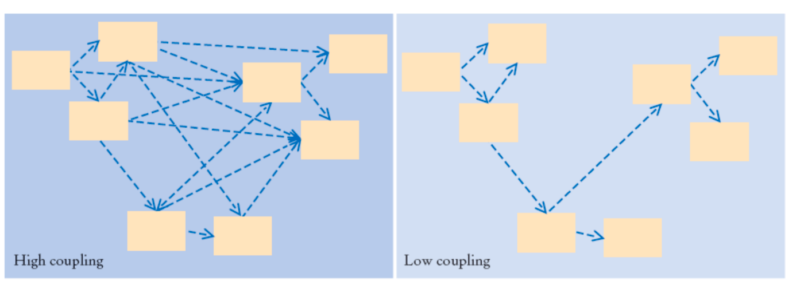
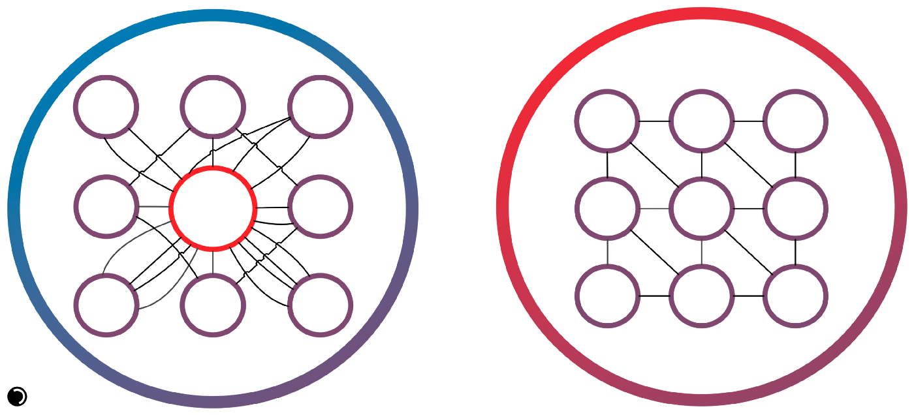
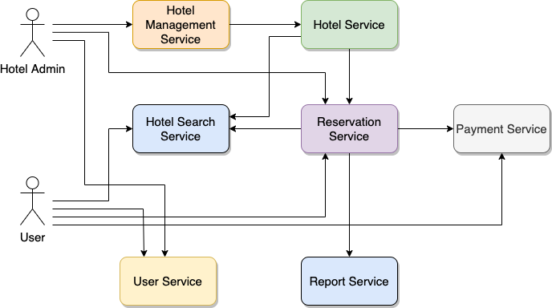
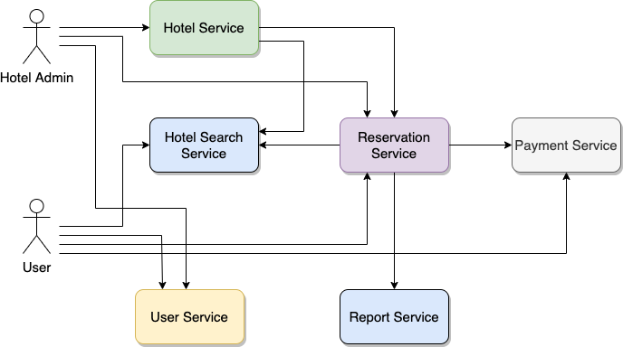

# Декомпозиция на Микросервисы

Поговорим сначала про критерии хорошего разбиения микросервиса:

* Low Coupling (Слабая Связанность).
* High Cohesion (Высокая Сопряженность).

Это значит, что программный компонент имеет небольшое число внешних связей и отвечает за решение близких по смыслу
задач.

### Связанность / Coupling
Сильная связанность (High coupling) рассматривается как серьёзный недостаток, поскольку затрудняет понимание логики
модулей, их модификацию, автономное тестирование, а также повторное использование по отдельности.

Степень связанности (Coupling) — это мера, определяющая, насколько жестко один элемент связан с другими элементами, либо
каким количеством данных о других элементах он обладает.

Элемент с низкой степенью связанности (или слабым связыванием) зависит от не очень большого числа других элементов и
имеет следующие свойства:

* малое число зависимостей между классами (подсистемами);
* слабая зависимость одного класса (подсистемы) от изменений в другом классе (
  подсистеме);
* высокая степень повторного использования подсистем.

#### Связанность содержимого (Content Coupling)

* один модуль изменяет или полагается на внутренние особенности другого модуля (
  например, использует локальные данные другого модуля).
* Изменение работы второго модуля приведет к переписыванию первого.

#### Связанность через общее (Common Coupling)

* Два модуля работают с общими данными (например, глобальной переменной).
* Изменение разделяемого ресурса приведет к изменению всех работающих с ним модулей.

#### Связанность через внешнее (External Coupling)

* Два модуля используют навязанный извне формат данных, протокол связи и т.д.
* Обычно возникает из-за внешних сущностей (инструментов, устройств и т.д.).

#### Связанность по управлению (Control Coupling)

* Один модуль управляет поведением другого.
* Присутствует передача информации о том, что и как делать.

#### Связанность по структурированным данным (Data-Structured Coupling, Stamp Coupling)

* Модули используют одну и ту же структуру, но каждый использует только ее части.
* Изменение структуры может привести к изменению модуля, который измененную часть даже не использует.

#### Связанность через данных (Data Coupling)

* Модули совместно используют данные, например, через параметры.
* Элементарные фрагменты маленькие и только они используются модулями совместно.

#### Связанность по сообщениям (Message Coupling)

* Модули общаются только через передачу параметров или сообщений
* Состояние децентрализовано.

#### Отсутствие связанности (No Coupling)

Модули вообще никак не взаимодействуют

### Сопряженность / Cohesion

Сопряженность характеризует то, насколько хорошо все методы класса или все фрагменты метода соответствуют главной цели,
— иначе говоря, насколько сфокусирован класс.

Считается, что объект (подсистема) обладает высокой связностью (High Cohesion), если его обязанности хорошо согласованы
между собой и он не выполняет огромных объемов работы.

Класс с низкой связностью (Low Cohesion) выполняет много разнородных функций или несвязанных между собой обязанностей.
Такие классы создавать нежелательно, поскольку они приводят к возникновению следующих проблем:

* трудность понимания;
* сложность при повторном использовании;
* сложность поддержки;
* ненадежность, постоянная подверженность изменениям.

Классы с низкой степенью связности, как правило, являются слишком "абстрактными"
или выполняют обязанности, которые можно легко распределить между другими объектами.

* Случайная (Coincidental Cohesion) – части модуля сгруппированы случайным образом, единственное, что их объединяет —
  сам модуль.
* Логическая (Logical Cohesion) – части модуля логически относятся к одной проблеме, при этом части могут различаться по
  своей природе.
* Временная (Temporal Cohesion) – части модуля обычно используются в программе в одно время, рядом.
* Процедурная (Procedural Cohesion) – части модуля всегда используются в определенном порядке.
* По взаимодействию (Communication Cohesion) – части модуля работают над одним и теми же данными.
* По последовательности действий (Sequential Cohesion) – результат работы одной части модуля является исходными данными
  для другой.
* Функциональная (Functional Cohesion) – части модуля направлены на решение одной четкой задачи, за которую отвечает
  модуль.

## Разбиение по бизнес-возможностям

Один из самых очевидных способов декомпозиции задачи на микросервисы – это разбиение по бизнес-возможностям. В
приложении описываются все функции (обычно как группы UseCase) и на их основе выделяются сервисы, инкапсулирующие в себе
работу с этими бизнес-функциями. Другими словами – в этом подходе микросервис отвечает за законченную
бизнес-функциональность.

Разбиение по бизнес возможностям _не равняется разбиению_ по сущностям. Бизнес-возможности определяют то, чем занимается
организация и из чего она генерирует прибыль.

### Сервис Бронирования Отелей

UseCase Сервиса Бронирования Отелей (далее bk.com):

1. Я как _Неавторизованный Пользователь_ могу просматривать _Отели_ в выбранном регионе.
2. Я как _Пользователь_ могу авторизоваться на сайте bk.com
3. Я как _Авторизованный Пользователь_ могу забронировать _Отель_ в выбранном регионе на конкретные даты и Оплатить.
4. Я как _Владелец Отеля_ могу подтвердить _Бронирование_ пользователя в моем _Отеле_ на конкретные даты.
5. Я как _Владелец Отеля_ могу создавать свой _Отель_ в системе bk.com.
6. Я как _Авторизованный Пользователь_ могу отменить свое _Бронирование_ в _Отеле_.
7. Я как _Владелец Отеля_ могу посмотреть агрегированные данные о _Бронированиях_ в моем _Отеле_.

* Hotel Search Service – сервис, содержащий подготовленную для поиска информацию из Hotel Service.
* Report Service – агрегирующий сервис для построения отчетов.

## Domain Driven Design

При разбиении по бизнес-возможностям могут появиться так называемые God Classes — сущности, которые будут общими для
нескольких микросервисов. Как правило, их очень сложно разделить.

Чтобы избежать появления God Classes, можно использовать альтернативный шаблон разложения на микросервисы — разбиение по
поддоменам. Он основан на концепциях предметно-ориентированного проектирования (Domain-Driven Design, DDD).

DDD (проблемно-ориентированное проектирование) основано на подходе, при котором классы моделируются на основе реальных
бизнес процессов. В контексте создания приложений DDD рассматривает проблемы как домены (предметные области). Этот
подход описывает независимые проблемные области как ограниченные контексты (каждый ограниченный контекст соответствует
микросервису).

У каждого домена своя модель данных, область действия которой принято называть ограниченным контекстом
(Bounded Context). Каждый микросервис будет разрабатываться внутри этого ограниченного контекста. Основная задача при
использовании DDD-подхода — подобрать поддомены и границы между ними так, чтобы они были максимально независимы друг от
друга.

### Bounded Context

При проектировании архитектуры в первую очередь нужно унифицировать предметную модель, чтобы все части системы
подразумевали под понятиями одно и то же, но это сделать очень сложно. Вместо этого DDD делит систему на Bounded
Context, каждый из которых может иметь унифицированную модель.

Bounded Context – это граница, внутри которой существует модель предметной области. При правильном разделении, границы
этих областей будут слабо связаны друг с другом, тем самым изменения в одном контексте будет оказывать минимальное
влияние на другие.

Bounded Context имеет как несвязанные концепции (например, запрос в службу поддержки, существующий только в контексте
поддержки клиентов), так и общие концепции (например, продукты и клиенты). Различные контексты могут иметь совершенно
разные модели общих понятий с механизмами сопоставления этих многозначных понятий для интеграции.

Если необходимо, чтобы две микросервиса активно взаимодействовали друг с другом, то, скорее всего, они должны быть одним
микросервисом.

### Сервис Бронирования Отелей

Рассмотрим пример с Сервисом Бронирования Отелей в разрезе DDD. Выделим основные сущности:

| Service                  | Entity                        |
|--------------------------|-------------------------------|
| Hotel Management Service | **Hotel**                     |
| Hotel Service            | **Hotel**                     |
| Hotel Search Service     | Hotel *                       |
| User Service             | User                          |
| Reservation Service      | Reservation                   |
| Report Service           | Aggregate: Hotel, Reservation |

Получается, Hotel Service и Hotel Management Service оперируют одной и той же сущностью Hotel, а значит они принадлежат
одному Bounded Context. Reservation Service работает с сущностью Reservation и принадлежит другой предметной, имея лишь
ссылку на Hotel.

Hotel Search Service и Report Service являются агрегирующими сервисами, они зависят от сущностей Hotel и Reservation, но
являются потребителями данных из Master-системы.

## Database-per-Service

Как было сказано раньше, самый плохой тип связности – это связность по данным. Когда вы работаете с монолитом, под ним
есть единая база данных и все части системы работают с ней. В рамках одной операции одна часть записала данные, в рамках
другой операции эти данные были вычитаны другой частью системы. В микросервисной архитектуре такой подход неприемлем,
т.к. разные сервисы, решающие разные задачи, за которые отвечают разные команды, не могут иметь общее хранилище, т.к.
это может привести к неконтролируемому поведению системы и будет блокировать развитие системы.

Если система A и B имеют общее хранилище данных, то любые изменения в нем должны быть синхронизированы между командами.
А каждая команда имеет свой backlog, свои приоритеты и планы развития сервиса, которые могут не ложиться на предложенные
изменения. Соответственно, любое развитие будет крайне затруднительно и требовать синхронные изменения в двух сервисах.

Резюмируя вышесказанное: _Два микросервиса не должны иметь общую Базу Данных._

Если рассматривать API сервер и набор Worker, которые получают задания от сервера, то они могут смотреть в общую Базу
Данных, но их правильно рассматривать как единый сервис, а значит это не нарушает описанное выше правило.

Если данные требуется в нескольких сервисах, то выделяется Master-сервис по данным, ответственный за их хранение и
модификацию, а остальные сервисы, кому эти данные нужны, ходят за ними. Дублирование данных допускается, но нужно быть
осторожным, т.к. состояние данных должно быть консистентно с Master-сервисом. Т.е. если на Master-сервисе произошло
обновление данных, то остальные сервисы об этом должны как-то узнать (например, через широковещательное сообщение в
очередь).

## Aggregation Service

Часто при реализации сложной операции возникает вопрос: где и как собирать данные и как контролировать целостность
операции?

Для контроля выполнения сложных запросов можно выделить отдельный сервис агрегатор, который для запросов на чтение будет
собирать информацию, а для запросов, модифицирующих данные, контролирует корректность завершения операций. Т.е. все
запросы проходят через этот сервис, он знает все про все операции:

* какие сервисы участвуют в процессе;
* какие данные передаются на вход и выход;
* как собирать результирующий ответ.

Фактически мы Aggregation Service – это реализация синхронной оркестрируемой саги (Orchestration SAGA).

Этот подход может показаться удобным, но он может привести к очень сложному агрегатору (размером с монолит) и набору
глупых CRUD сервисов, тем самым получив Связность по Управлению.

## Разбиение монолита: паттерн Душитель

Этот шаблон означает миграцию монолитного приложения на микросервисную архитектуру путем постепенного переноса
существующих функций в микросервисы. Настраивается маршрутизация запросов между устаревшим монолитом и микросервисами.
Когда очередная функциональность переносится из монолита в микросервисы, фасад перехватывает клиентский запрос и
направляет его к микросервисам. Новые функции при этом реализуются исключительно в микросервисах, минуя монолит. После
переноса всех функций монолитное приложение полностью выводится из эксплуатации.

Паттерн не рекомендуется использовать при небольших размерах монолита. В таком случае лучшим решением будет его
единовременный перевод на микросевисную архитектуру, так как добавление фасада увеличивает задержки и затрудняет
тестирование.

## Миграция базы данных

Как бы ни был хорошо спроектирована архитектура и базы данных, все равно в один прекрасный момент будет задача, которая
потребует изменения существующих сервисов (распиливания на несколько, например) или по крайней мере изменения текущей
схемы Базы Данных.

Здесь мы рассматриваем процессы изменения структуры базы данных когда там уже есть данные, которые мы не можем потерять,
и их объем не позволяет мигрировать с помощью единой SQL команды.

Важно понимать, что при огромных объемах данных, модификация структуры таблицы невозможна. Т.е. если нужно добавить или
изменить поля, то требуется создать новую таблицу с нужной структурой данных.

### Фоновые процессы переливки данных

Самый простой и очевидный способ миграции Базы Данных – это фоновый процесс переливки.

* SQL процедура, которая читает данные по кускам, модифицирует и перекладывает в другую таблицу. Если нужно положить
  данные в другую Базу Данных, то можно
  использовать [dblink](https://www.postgresql.org/docs/current/contrib-dblink-function.html).
* Если `dblink` запрещен или SQL запрос получается очень сложный, то можно использовать batch скрипты (например, Spring
  Boot Batch), которые просто будут иметь два подключения к двум базам данных, читать данные из первой, преобразовывать
  их в памяти и класть в другую базу.

Если требуется выполнить переливку данных на работающем приложении, то это делается в три этапа:

* новые данные пишутся в новую и старую структуру;
* переливаются данные от 1 до N, где N – последняя запись на момент запуска;
* после окончания переливки, запросы меняются на новую схему.

### Read-is-a-Move

Если выполнить переливку за разумное время невозможно, то в приложении пишется умный routing, который при чтении данных
из старой структуры данных, перекладывает их в новую.

Обычно, если требуется воспользоваться таким решением, скорее всего хранилище используется для получения данных по
ключу (по ID), а поиск выполняется через какие-то другие инструменты. Т.е. поиск выдает список ID, по которым приложение
идет в Базу Данных и получает конкретные записи.

## Литература

1. [Low Coupling и High Cohesion](https://medium.com/german-gorelkin/low-coupling-high-cohesion-d36369fb1be9)
2. [Human Networks: Coupling, Cohesion & Encapsulation](https://medium.com/the-ready/human-networks-coupling-cohesion-encapsulation-1f415e775820)
3. [26 основных паттернов микросервисной разработки](https://mcs.mail.ru/blog/26-osnovnyh-patternov-mikroservisnoj-razrabotki)
4. [Bounded Context](https://martinfowler.com/bliki/BoundedContext.html)
5. [Microservices](https://martinfowler.com/articles/microservices.html)
6. [Проектирование микрослужбы, ориентированной на DDD](https://docs.microsoft.com/ru-ru/dotnet/architecture/microservices/microservice-ddd-cqrs-patterns/ddd-oriented-microservice)
