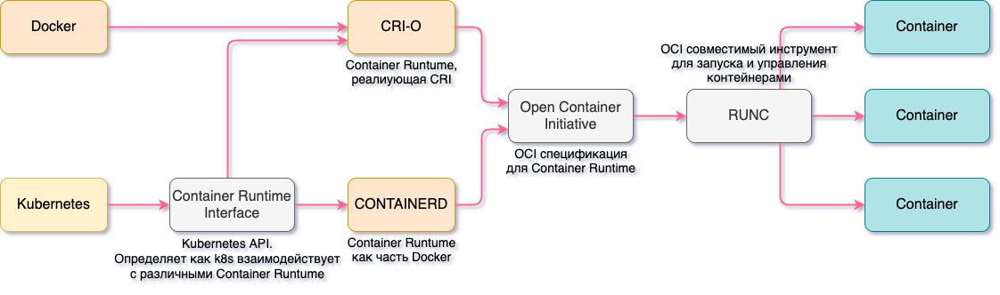
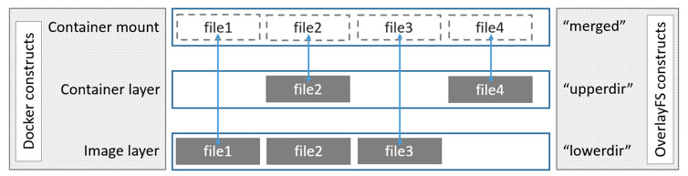
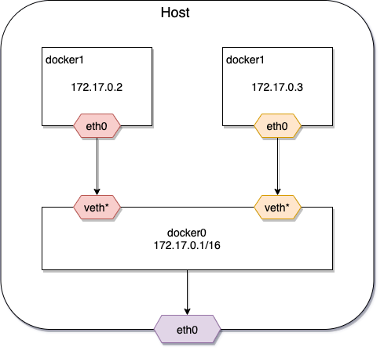

# Docker

Docker - это средство виртуализации, одно из назначений которого виртуализация рабочих сред на серверах. Также он
предоставляет универсальный способ доставки приложений на машины (локальный компьютер или удаленные сервера) и их
запуска в изолированном окружении.

Основные понятия:

* Образ (Image) — это read-only шаблон для создания Docker-контейнеров. Представляет собой исполняемый пакет, содержащий
  все необходимое для запуска приложения: код, среду выполнения, библиотеки, переменные окружения и файлы конфигурации.
  Docker-образ состоит из слоев. Каждое изменение записывается в новый слой.
* Контейнер (Container) — запущенный процесс операционной системы в изолированном окружении с подключенной файловой
  системой из образа.

Контейнер — всего лишь обычный процесс операционной системы. Разница лишь в том, что благодаря возможностям ядра, docker
стартует процесс в изолированном окружении. Контейнер видит свой собственный список процессов, свою собственную сеть,
свою собственную файловую систему и т.д. Пока ему не укажут явно, он не может взаимодействовать с вашей основной
операционной системой и всем, что в ней хранится или запущено.

## Предпосылки возникновения контейнеризации


##### Традиционная эра развертывания

Раньше приложения запускали на физических серверах, поэтмоу не было никакого способа определить границы ресурсов для
приложений на физическом сервере, и это вызвало проблемы с распределением ресурсов. Например, если несколько приложений
выполняются на физическом сервере, могут быть случаи, когда одно приложение будет занимать большую часть ресурсов, и в
результате чего другие приложения будут работать хуже. Решением этого было запустить каждое приложение на другом
физическом сервере. Из-за этого прилоежния не использовали всю мощность серверов, где они запущены, но место в
датацентрах и сами сервера стоили дорого, а значит использование нескольких серверов получалось финансово невыгодно.

##### Эра виртуализации

В качестве решения была представлена виртуализация. Она позволила запускать несколько виртуальных машин (VM) на одном
физическом сервере. Виртуализация изолирует приложения между виртуальными машинами и обеспечивает определенный уровень
безопасности, поскольку информация одного приложения не может быть свободно доступна другому приложению.

Виртуализация позволяет лучше использовать ресурсы на физическом сервере и обеспечивает лучшую масштабируемость,
поскольку приложение можно легко добавить или обновить, кроме этого снижаются затраты на оборудование и многое другое. С
помощью виртуализации можно превратить набор физических ресурсов в кластер одноразовых виртуальных машин.

Каждая виртуальная машина представляет собой полноценную машину, на которой выполняются все компоненты, включая
собственную операционную систему, поверх виртуализированного оборудования.

##### Эра контейнеризации

Контейнеры похожи на виртуальные машины, но у них есть свойства изоляции для совместного использования операционной
системы (ОС) между приложениями, поэтому контейнеры считаются легкими. Подобно виртуальной машине, контейнер имеет свою
собственную файловую систему, процессор, память, пространство процесса и многое другое. Поскольку они не связаны с
базовой инфраструктурой, они переносимы между облаками и дистрибутивами ОС.


## Архитектура Docker

Docker использует архитектуру клиент-сервер. Docker клиент общается с docker daemon, который берет на себя задачи
создания, запуска, распределения контейнеров. Клиент и сервер общаются через сокет (по-умолчанию) или через REST API.


Docker Engine — ядро механизма Докера, он отвечает за функционирование и обеспечение связи между основными
docker-объектами (реестром, образами и контейнерами).

* `Docker Daemon` выполняет инициализацию демона (фоновой программы), который применяется для управления и модификации
  контейнеров, образов и volumes.
* `REST API` — механизм, отвечающий за организацию взаимодействия Docker Client и Docker Daemon.
* `CLI` — позволяет пользователю взаимодействовать с сервером при помощи команд, набираемых в терминале.

Для работы docker использует следующие механизмы операционной системы:

##### namespaces

Namespaces – это механизм ядра Linux, обеспечивающий изоляцию процессов друг от друга. Включает в себя:

* network – предоставляет контейнеру свое представление сетевого стека (interfaces, routing tables, network devices, и
  т.д.);
* mounts – точки монтирования;
* UTS – Unix Timeshare System, позволяет процессам иметь свои системные идентификаторы hostname и NIS domain name,
  отличные от других контейнеров и host-машины;
* user – изоляция пользователей внутри контейнера;
* IPC – InterProcess Communication, ответственна за изоляцию ресурсов между процессами внутри контейнера.


##### cgroups

Docker использует технологию ядра Linux cgroups, которая изолирует, приоритизирует и выдает квоты на использование
ресурсов системы для группы процессов. С помощью этой технологии контейнеры docker получают только те ресурсы, которые
были ему выделены.


### CRI-O, containerd, runc



* `Container Runtime Interface` (`CRI`) — это API, который Kubernetes использует для управления различными Container
  Runtime, создающими и управляющими контейнерами. CRI упрощает для Kubernetes использование различных Container
  Runtime. Вместо того чтобы включать в Kubernetes поддержку каждой из них, используется стандарт CRI. При этом задача
  управления контейнерами полностью ложится на Container Runtime.
* `containerd` – Linux Daemon, который управляет контейнерами и запускает их. Он загружает образы из репозитория,
  управляет хранилищем и сетью, а также контролирует работу контейнеров.
* `runc` – низкоуровневая среда выполнения контейнеров, которая создает и запускает контейнеры.

В Kubernetes kubelet для работы с container runtime использует Container Runtime Interface, при этом весь код
взаимодействия с контейнерами выполняется через CRI. Docker не поддерживает CRI напрямую, поэтому kubelet включает
компонент под названием dockershim, который транслирует команды из CRI в docker.

Начиная с версии 1.22 Kubernetes отказываются от поддержки dockershim, соответственно, Docker и будет работать только с
Container Runtime, поддерживающими Container Runtime Interface (CRI) — containerd или CRI-O.

Но это не означает, что Kubernetes не сможет запускать контейнеры из Docker образов. И containerd, и CRI-O могут
запускать образы в формате Docker (фактически в формате OCI), они просто делают это без использования команды docker и
Docker Daemon.


### Структура образа

Образ состоит из слоев, каждый из которых представляет собой неизменяемую файловую систему, а по-простому набор файлов и
директорий. Образ в целом представляет собой объединенную файловую систему (Union File System), которую можно
рассматривать как результат слияния файловых систем слоев. Объединенная файловая система умеет обрабатывать конфликты,
например, когда в разных слоях присутствуют файлы и директории с одинаковыми именами. Каждый следующий слой добавляет
или удаляет какие-то файлы из предыдущих слоев. В данном контексте "удаляет" можно рассматривать как "затирает", т.е.
файл в нижележащем слое остается, но его не будет видно в объединенной файловой системе.

Главное различие между контейнером и образом – это верхний writable-слой. Все операции модификации хранятся в этом слое.
Когда контейнер удаляется, этот слой тоже удаляется, а предыдущие слои не изменяются. Потому что каждый контейнер имеет
writable-слой, где хранятся все изменения, различные контейнеры могут иметь общие слои и при этом иметь сво


Поскольку у каждого контейнера есть собственный writable-слов, где хранятся все изменения, несколько контейнеров могут
совместно использовать доступ к одному и тому же базовому образу и при этом иметь собственное состояние данных.

```shell
$ cd examples
$ docker compose up -d

$ docker ps -s
CONTAINER ID   IMAGE                              NAMES             SIZE
99ce866687ab   romanowalex/simple-frontend:v1.0   simple-frontend   376B (virtual 24MB)
acca5451de93   romanowalex/simple-backend:v1.0    simple-backend    32.8kB (virtual 700MB)
5018446e6139   postgres:13                        postgres          63B (virtual 373MB)
```

* size – объем на диске, который используется для writable-слоя;
* virtual size – объем на диске, который используется для read-only слоев плюс writable-слой.

Образ использует AuFS (advanced multi-layered unification filesystem - вспомогательная файловая система, образующая
каскадно-объединённое монтирование для файловых систем Linux) для прозрачного монтирования файловых систем.

В папке `/var/lib/docker/overlay2` слови представлены папками, в папке `l` хранятся коротки ссылки на папки (`diff`) для
использования в команде mount. В каждом образе хранится (кроме базового, там только `link` и `diff`):

* `link` – файл, который содержит короткое имя директории из папки `l`;
* `lower` – файл, который ссылается на короткое имя родителя;
* `diff` – директория, которая содержит данные самого образа;
* `merged` – актуальный контент этого образа (слитый с родительским `diff`);
* `work` – для внутреннего использования в OverlayFS.

OverlayFS сливает два каталога и представляет их как один каталог, эти каталоги называются слоям. OverlayFS обращается к
нижнему каталогу как к `lowerdir`, а к верхнему каталогу — как к `upperdir`. Унифицированное представление доступно
через собственный каталог, который называется merged.



У каждого слоя изображения есть собственный каталог в `/var/lib/docker/overlay/`, который содержит его содержимое.
(LayerID != directory ID)

Начиная с версии Docker 1.10 образы и слои, больше не являются синонимами. Вместо этого образ напрямую ссылается на один
или больше слоев, которые в конечном итоге сливаются в файловую систему контейнера.

Слои теперь идентифицируются hash, который имеет форму `<тип алгоритма>:<hash>`. Значение вычисляется путем применения
алгоритма (sha256) к содержимому слоя. Если содержимое изменится, то вычисленный hash также изменится, а это означает,
что Docker может сверить полученное содержимое слоя с его опубликованным hash, чтобы проверить его содержимое. Слои не
имеют представления о принадлежности к образу, они представляют собой просто наборы файлов и каталогов.

Слои хранятся внутри аналогично образам. Они описываются в каталоге `/lib/docker/image/overlay2/layerdb/sha256/` и
содержат связку между directory ID и Layer ID. Каждая из директорий содержит следующие файлы:

* `diff` – содержит hash слоя (может не совпадать с именем директории);
* `size` – физический размер слоя;
* `cache-id` – содержит directory ID.

```shell
$ cd examples/docker
$ vagrant up
$ ssh ansible@192.168.56.100

$ curl -fsSL https://download.docker.com/linux/ubuntu/gpg | sudo apt-key add -

$ sudo add-apt-repository "deb [arch=amd64] https://download.docker.com/linux/ubuntu focal stable"

$ sudo apt-get update

$ sudo apt-get install -y \
    jq \
    docker-ce \
    docker-ce-cli \
    containerd.io \
    docker-compose-plugin

$ sudo usermod -aG docker ansible

$ exit

$ ssh ansible@192.168.56.100

$ docker run hello-world

$ wget -O /tmp/dive.deb https://github.com/wagoodman/dive/releases/download/v0.9.2/dive_0.9.2_linux_amd64.deb
$ sudo apt install /tmp/dive.deb

$ docker pull postgres:13-alpine

$ docker image inspect --format "{{json .RootFS.Layers}}" postgres:13-alpine | jq
[
  "sha256:994393dc58e7931862558d06e46aa2bb17487044f670f310dffe1d24e4d1eec7",
  "sha256:c107d84c5ee5434184266dd999ba59186dbe34ef4c6d1464f2ddd742f5eaa7f8",
  "sha256:1191ff7875541dfd09e2f07b69b294d01cae17d396860e2d255308cb4ee9de5f",
  "sha256:cd27e8fe70814af54c1320fcb6f9395589188c1af202d784dc09fd2fe0c5d9ec",
  "sha256:a1d3de8ff553b04e12df7068c99d824a9f860947d306feee9200a14127fd9a0b",
  "sha256:c299f2771a0f2ac5f22deb1008c32c58fef5fa24bb11ed5a23b63def5887b798",
  "sha256:e90d97e0fb0c12656fa4a7f9629c28d53065d2478a1dcbe79ae7b5eb0eb53e8e",
  "sha256:86565deff7509eb519ca0cce06484f6d6dcdabd50c2b3995768c27cccc1301c9"
]

# Данные лежат в слоев лежат в /var/lib/docker/overlay2/
$ ls -l /var/lib/docker/overlay2/
drwx--x--- 4 root root 4.0K Nov  5 20:42 1a2482afeba6d95a6d6dfd3d6a22bfdfddca75595c9df597b55dd76823873c33/
drwx--x--- 4 root root 4.0K Nov  5 20:42 1a2482afeba6d95a6d6dfd3d6a22bfdfddca75595c9df597b55dd76823873c33-init/
drwx--x--- 4 root root 4.0K Nov  5 20:43 3030da422b0e202b27ef1dacbcb9cfc16bb737573e8d30e1d3b4a2e7dc9b101c/
drwx--x--- 4 root root 4.0K Nov  5 20:43 3030da422b0e202b27ef1dacbcb9cfc16bb737573e8d30e1d3b4a2e7dc9b101c-init/
drwx--x--- 4 root root 4.0K Nov  6 05:55 56eea650bd4855676c0c57405d351bcfa804704317ee503308150eaabaad3a34/
drwx--x--- 4 root root 4.0K Nov  5 21:07 56eea650bd4855676c0c57405d351bcfa804704317ee503308150eaabaad3a34-init/
drwx--x--- 4 root root 4.0K Nov  5 21:01 731c1ef12f136de868b6c76fd3b6a3e055ac5f3817516927a1f389ee88d93a0e/
drwx--x--- 4 root root 4.0K Nov  5 21:01 873a8c55cf4f368f397889035599c1b5fbe87dd48bb3cead653f73ed5305959b/
drwx--x--- 4 root root 4.0K Nov  5 21:05 969c6ca1a5d0caf4aab84d89de31a4dd017f27be18adea13db70c6e480efc3cb/
drwx--x--- 3 root root 4.0K Nov  5 21:01 9e6909cf6f857a19e27ca5e054dbfbd8c3d26f861e88213c4c697b3db9d4fd8f/
drwx--x--- 4 root root 4.0K Nov  5 21:01 ab11108080f9d6f64382bc8969e27fa37f3dc523c9b66b0e15ab9c3be2c19671/
drwx--x--- 4 root root 4.0K Nov  5 21:01 c6916816315ab081b673254e528ff02decb8111b88eacd4a118cf856ab47e281/
drwx--x--- 3 root root 4.0K Nov  5 20:42 d3d6fbdac894d1c6b038bc4141b4bfbc46a54b6da16f79f198b14b11286234dc/
drwx--x--- 4 root root 4.0K Nov  5 21:01 d8ce16555aa3ffa154c7b84f99138cbde317f447f3fde3289f5045a3490498dc/
drwx--x--- 4 root root 4.0K Nov  5 21:05 e5ae3537d4efe5213b6677bbeb6f6b3c4c4106d66f95546794dbc2b5456e79b6/
drwx--x--- 4 root root 4.0K Nov  5 21:05 e5ae3537d4efe5213b6677bbeb6f6b3c4c4106d66f95546794dbc2b5456e79b6-init/
drwx--x--- 4 root root 4.0K Nov  5 21:01 ee3adbd629acc5fc5bbd69bd968862f9f8bcb3e5627436d6925b287a354f19d3/
drwx------ 2 root root 4.0K Nov  5 21:08 l/

# в папке l хранятся коротки ссылки на папки (diff) для использования в команде mount
$ ls -l /var/lib/docker/overlay2/l/
lrwxrwxrwx 1 root root 72 Nov  5 21:01 2V5VOYBYTBNSA2LGE3UMSOR7KL -> ../ab11108080f9d6f64382bc8969e27fa37f3dc523c9b66b0e15ab9c3be2c19671/diff/
lrwxrwxrwx 1 root root 72 Nov  5 21:01 5BC5KJ4XT3Z25IMQVCLEULG5XT -> ../c6916816315ab081b673254e528ff02decb8111b88eacd4a118cf856ab47e281/diff/
lrwxrwxrwx 1 root root 72 Nov  5 21:05 CD5DVCWGE6R4XFPPQASG5JXSR4 -> ../e5ae3537d4efe5213b6677bbeb6f6b3c4c4106d66f95546794dbc2b5456e79b6/diff/
lrwxrwxrwx 1 root root 77 Nov  5 20:43 EGOL3MVQVAQHO5VN5LPFWTICCU -> ../3030da422b0e202b27ef1dacbcb9cfc16bb737573e8d30e1d3b4a2e7dc9b101c-init/diff/
lrwxrwxrwx 1 root root 72 Nov  5 21:01 GV2ZGRDPJPTPDWPETTXTBGHPLB -> ../9e6909cf6f857a19e27ca5e054dbfbd8c3d26f861e88213c4c697b3db9d4fd8f/diff/
lrwxrwxrwx 1 root root 72 Nov  5 21:01 HJ4S43EUDKOXIKA4UPJYW5FW4B -> ../ee3adbd629acc5fc5bbd69bd968862f9f8bcb3e5627436d6925b287a354f19d3/diff/
lrwxrwxrwx 1 root root 72 Nov  5 21:01 IJUGCX5ETVC2DLOUJZLVT44QFI -> ../731c1ef12f136de868b6c76fd3b6a3e055ac5f3817516927a1f389ee88d93a0e/diff/
lrwxrwxrwx 1 root root 72 Nov  5 21:01 KPG2WP2WSKTRNZZICBTZJGNDZ4 -> ../d8ce16555aa3ffa154c7b84f99138cbde317f447f3fde3289f5045a3490498dc/diff/
lrwxrwxrwx 1 root root 72 Nov  5 20:42 Q332M2GWS72CS3PAV5T62RHEMK -> ../d3d6fbdac894d1c6b038bc4141b4bfbc46a54b6da16f79f198b14b11286234dc/diff/
lrwxrwxrwx 1 root root 77 Nov  5 21:07 R7AIIRLLWCQRG77JZAGVC73U77 -> ../56eea650bd4855676c0c57405d351bcfa804704317ee503308150eaabaad3a34-init/diff/
lrwxrwxrwx 1 root root 72 Nov  5 21:01 RPJLXSMMDMKUNBYIRDG72BXX6E -> ../873a8c55cf4f368f397889035599c1b5fbe87dd48bb3cead653f73ed5305959b/diff/
lrwxrwxrwx 1 root root 77 Nov  5 21:05 RS4ISVS5WKY6U4Y2YYTNRS43RO -> ../e5ae3537d4efe5213b6677bbeb6f6b3c4c4106d66f95546794dbc2b5456e79b6-init/diff/
lrwxrwxrwx 1 root root 72 Nov  5 21:07 S63HBRFNHNFMRAPOKGCGHP67OP -> ../56eea650bd4855676c0c57405d351bcfa804704317ee503308150eaabaad3a34/diff/
lrwxrwxrwx 1 root root 77 Nov  5 20:42 SPLVF4QNHKGJMGGGNMOLIDSZLS -> ../1a2482afeba6d95a6d6dfd3d6a22bfdfddca75595c9df597b55dd76823873c33-init/diff/
lrwxrwxrwx 1 root root 72 Nov  5 20:43 TWD5VJVTPWLAOITTZVWT3XQBHS -> ../3030da422b0e202b27ef1dacbcb9cfc16bb737573e8d30e1d3b4a2e7dc9b101c/diff/
lrwxrwxrwx 1 root root 72 Nov  5 20:42 VCAQCPQMQJI5ME6462LM5SASIY -> ../1a2482afeba6d95a6d6dfd3d6a22bfdfddca75595c9df597b55dd76823873c33/diff/
lrwxrwxrwx 1 root root 72 Nov  5 21:01 Y4GTDIJ5VVUDIO2JO4SX2U6PG2 -> ../969c6ca1a5d0caf4aab84d89de31a4dd017f27be18adea13db70c6e480efc3cb/diff/

# LayerID не равен directory ID, их связка (sha256) хранится в /var/lib/docker/image/overlay2/layerdb/sha256/ 
$ ls -al /var/lib/docker/image/overlay2/layerdb/sha256/
drwx------  2 root root 4096 Nov  5 21:01 070c03fccb2906f60ec43569980287814802f7d0b2d3dcc714bc5ef1c86f373a/
drwx------  2 root root 4096 Nov  5 21:01 12ecc7f7b876721f4d958e20fc3c1c7d9227508c62d903ade63e199f0f0280ce/
drwx------  2 root root 4096 Nov  5 21:01 4dab68415bc6bc7655ecb95fb07e1d593903fc053820b165a9f36d3711f02806/
drwx------  2 root root 4096 Nov  5 21:01 88af384590de04a47b9b659583ea4852f8a6cfae0660b2985f64fa3296b4c400/
drwx------  2 root root 4096 Nov  5 21:01 8b92637bd54864bdd672e0b4f90143663aec23aa25a8265391d039c39efcf30f/
drwx------  2 root root 4096 Nov  5 21:01 934d24deeb153a2ca4f24035b3b9aeb42b265108a35ca74d52782fe84ff031d1/
drwx------  2 root root 4096 Nov  5 21:01 994393dc58e7931862558d06e46aa2bb17487044f670f310dffe1d24e4d1eec7/
drwx------  2 root root 4096 Nov  5 21:01 ad2999dcc3a48c967d0d5a498b564c3c93bb2c45c5403d70d42fe763283d13c4/
drwx------  2 root root 4096 Nov  5 20:42 e07ee1baac5fae6a26f30cabfe54a36d3402f96afda318fe0a96cec4ca393359/

# ищем слой 86565deff, где хранится docker-entrypoint.sh:
# * в diff хранится sha слоя;
# * в cache-id хранится папка /var/lib/docker/overlay2/.
$ grep -RI '86565deff7509eb519ca0cce06484f6d6dcdabd50c2b3995768c27cccc1301c9' .
./4dab68415bc6bc7655ecb95fb07e1d593903fc053820b165a9f36d3711f02806/diff:sha256:86565deff7509eb519ca0cce06484f6d6dcdabd50c2b3995768c27cccc1301c9

$ cd 4dab68415bc6bc7655ecb95fb07e1d593903fc053820b165a9f36d3711f02806/

$ ls -l
-rw-r--r-- 1 root root  64 Nov  5 21:01 cache-id
-rw-r--r-- 1 root root  71 Nov  5 21:01 diff
-rw-r--r-- 1 root root  71 Nov  5 21:01 parent
-rw-r--r-- 1 root root   5 Nov  5 21:01 size

$ cat diff
sha256:86565deff7509eb519ca0cce06484f6d6dcdabd50c2b3995768c27cccc1301c9

$ cat cache-id
969c6ca1a5d0caf4aab84d89de31a4dd017f27be18adea13db70c6e480efc3cb

$ cd /var/lib/docker/overlay2/969c6ca1a5d0caf4aab84d89de31a4dd017f27be18adea13db70c6e480efc3cb

$ ls -l
-rw------- 1 root root    0 Nov  5 21:07 committed
drwxr-xr-x 3 root root 4.0K Nov  5 21:01 diff/
-rw-r--r-- 1 root root   26 Nov  5 21:01 link
-rw-r--r-- 1 root root  202 Nov  5 21:01 lower
drwx------ 2 root root 4.0K Nov  5 21:01 work/

$ ls -al diff/usr/local/bin/
-rwxrwxr-x 1 root root 12K Oct  7 01:17 docker-entrypoint.sh*
```

Для просмотра слоев контейнера удобно использовать утилиту [dive](https://github.com/wagoodman/dive).

## Основные команды docker

```shell
# запустить контейнер postgres:13 на порту 5432, данные сохранять в локальный volume с именем postgres-data
# и создать пользователя test:test и базу example
$ docker run \
    --name postgres \
    -p 5432:5432 \
    -e POSTGRES_USER=test \
    -e POSTGRES_PASSWORD=test \
    -e POSTGRES_DB=services \
    -v postgres-data:/var/lib/postgresql/data \
    postgres:13

# сборка образа frontend в папке example/frontend
$ docker build examples/frontend -t my-frontend:v1.0

# вывод всех образов
$ docker images

# вывод всех volumes
$ docker volume ls

# просмотр информации о конкретном volume
$ docker volume inspect postgres-data

# вывод логов контейнера
$ docker logs postgres 

# просмотр запущенных контейнеров
$ docker ps

# просмотр всех контейнеров
$ docker ps -a

# просмотр всех сведение о контейнере
$ docker inspect postgres 

# получение внутреннего ip-адреса контейнера
$ docker inspect --format='{{range .NetworkSettings.Networks}}{{.IPAddress}}{{end}}' postgres 

# получение пути к папке с логами контейнера
$ docker inspect --format='{{.LogPath}}' postgres 

# получение информации об используемом образе
$ docker inspect --format='{{.Config.Image}}' postgres 

# заход внутрь образа
$ docker exec --interactive --tty postgres /bin/bash 

# остановка, старт и рестарт контейнера
$ docker stop postgres 
$ docker start postgres 
$ docker restart postgres 

# информация о потребляемых ресурсах docker
$ docker stats

# удаление контейнера postgres
$ docker rm postgres 

# удаление образа postgres:13
$ docker rmi postgres:13

# показать запущенные процессы в контейнере
$ docker top postgres
```

## Dockerfile

```dockerfile
# Указывает с какого образаа брать сборку.
FROM ubuntu:20.04
# Указывает от какого пользоватя (и опционально группы) запускаются дальнейшие команды.
USER ronin:staff
# Информирует что образ слушает порт 8080 по протоколу tcp.
EXPOSE 8080/tcp
# Указывает из какой директории выполнять дальнейшие инструкции.
# Если указан относительный путь, он будет применяться относительно предыдущих инструкций WORKDIR.
WORKDIR application
# Определяет перменную, оторую пользователь может передать при запуске `docker build --build-arg <varname>=<value>`.
ARG PROFILE=docker
# Копирует файлы с host-машины в образ, доступны wildcards, --chmod user:user.
# ADD умеет распаковывать архивы, но в документации советуют использовать COPY, где магия ADD не требуется.
ADD https://github.com/Netflix/eureka/archive/refs/tags/v1.10.17.zip /app/eureka
COPY build/libs/order-service.jar /app/order-service.jar
# Задает переменные окружения. Переменная окружения будет определена для запущенного контейнера
ENV SPRING_PROFILES_ACTIVE=$PROFILE
# выполняет каждую команду в новом слое поверх текущего слоя.
RUN apt-get update && \
  apt-get install openjdk-11-jdk -y
# Задает дефолтную команду при старте. Одна команда на контейнер и может быть перезаписана при старте контейнера.
CMD ["bash", "-c", "echo $HOME"]
# Позволяет описывать контейнер как исполняемый.
# The ENTRYPOINT specifies a command that will always be executed when the container starts.
# The CMD specifies arguments that will be fed to the ENTRYPOINT
ENTRYPOINT ["java", "org.springframework.boot.loader.JarLauncher"]
```

Пример использования CMD и ENTRYPOINT:

```dockerfile
FROM ubuntu:20.04
RUN apt-get update && \
    apt-get install iputils-ping -y
ENTRYPOINT ["/bin/ping"]
CMD ["localhost"]
```

Запуск контейнера выдает следующее:

```shell
$ cd examples
$ docker build . -t ping
$ docker run ping
PING localhost (127.0.0.1) 56(84) bytes of data.
64 bytes from localhost (127.0.0.1): icmp_seq=1 ttl=64 time=0.033 ms
64 bytes from localhost (127.0.0.1): icmp_seq=2 ttl=64 time=0.094 ms
64 bytes from localhost (127.0.0.1): icmp_seq=3 ttl=64 time=0.270 ms

--- localhost ping statistics ---
3 packets transmitted, 3 received, 0% packet loss, time 2046ms
rtt min/avg/max/mdev = 0.033/0.132/0.270/0.100 ms

$ docker run ping ya.ru
PING ya.ru (87.250.250.242) 56(84) bytes of data.
64 bytes from ya.ru (87.250.250.242): icmp_seq=1 ttl=37 time=12.1 ms
64 bytes from ya.ru (87.250.250.242): icmp_seq=2 ttl=37 time=11.5 ms

--- ya.ru ping statistics ---
2 packets transmitted, 2 received, 0% packet loss, time 1002ms
rtt min/avg/max/mdev = 11.478/11.802/12.126/0.324 ms
```

### Оптимизация размера образа

Образ — это не что иное, как коллекция других образов, можно прийти к очевидному выводу: размер образа равен сумме
размеров образов, его составляющих.

```shell
$ docker history simple-backend:v1.0
IMAGE          CREATED       CREATED BY                                      SIZE      COMMENT
c1a96c337def   5 days ago    ENTRYPOINT ["java" "-Dserver.port=${PORT:-84…   0B        buildkit.dockerfile.v0
<missing>      5 days ago    COPY application/application/ ./ # buildkit     179kB     buildkit.dockerfile.v0
<missing>      5 days ago    COPY application/snapshot-dependencies/ ./ #…   0B        buildkit.dockerfile.v0
<missing>      5 days ago    COPY application/dependencies/ ./ # buildkit    126MB     buildkit.dockerfile.v0
<missing>      5 days ago    COPY application/spring-boot-loader/ ./ # bu…   252kB     buildkit.dockerfile.v0
<missing>      5 days ago    WORKDIR /application                            0B        buildkit.dockerfile.v0
<missing>      5 days ago    ENV PORT=8480                                   0B        buildkit.dockerfile.v0
<missing>      2 weeks ago   /bin/sh -c #(nop)  CMD ["jshell"]               0B        
<missing>      2 weeks ago   /bin/sh -c set -eux;   arch="$(dpkg --print-…   343MB     
<missing>      2 weeks ago   /bin/sh -c #(nop)  ENV JAVA_VERSION=11.0.13     0B        
<missing>      2 weeks ago   /bin/sh -c #(nop)  ENV LANG=C.UTF-8             0B        
<missing>      2 weeks ago   /bin/sh -c #(nop)  ENV PATH=/usr/local/openj…   0B        
<missing>      2 weeks ago   /bin/sh -c { echo '#/bin/sh'; echo 'echo "$J…   27B       
<missing>      2 weeks ago   /bin/sh -c #(nop)  ENV JAVA_HOME=/usr/local/…   0B        
<missing>      2 weeks ago   /bin/sh -c set -eux;  apt-get update;  apt-g…   11.3MB    
<missing>      2 weeks ago   /bin/sh -c apt-get update && apt-get install…   152MB     
<missing>      2 weeks ago   /bin/sh -c set -ex;  if ! command -v gpg > /…   18.9MB    
<missing>      2 weeks ago   /bin/sh -c set -eux;  apt-get update;  apt-g…   10.7MB    
<missing>      2 weeks ago   /bin/sh -c #(nop)  CMD ["bash"]                 0B        
<missing>      2 weeks ago   /bin/sh -c #(nop) ADD file:5259fc086e8295ddb…   124MB  
```

Каждая дополнительная инструкция в Dockerfile будет только увеличивать общий размер образа. Соответственно, чтобы
уменьшить результирующий размер образа:

* нужно объединять однотипные команды;
* использовать максимально компактный базовый образ, например на базе [Alpine Linux](https://hub.docker.com/_/alpine);
* использовать multistage build, чтобы не тащить в результирующий образ лишнее.

### Volumes

Для хранения данных между перезапусками контейнеров используется абстракция, называемая volume.

Для подключения конфигурационных файлов или добавления информации внутрь контейнера можно примонтировать папку с
host-машины: `--volume $(pwd)/postgres:/docker-entrypoint-initdb.d/`.

Для персистентного хранения данных лучше создать Volume и примонтировать его при запуке
контейнера `--volume data_volume:/var/lib/postgresql/data`.

```shell
$ docker volume create data_volume

$ docker volume ls
DRIVER    VOLUME NAME
local     micro-services-v2_db-data
local     micro-services-v2_grafana-data
local     micro-services-v2_prometheus-data
local     data_volume

$ docker volume inspect data_volume
[
    {
        "CreatedAt": "2021-12-01T12:59:47Z",
        "Driver": "local",
        "Labels": {},
        "Mountpoint": "/var/lib/docker/volumes/data_volume/_data",
        "Name": "data_volume",
        "Options": {},
        "Scope": "local"
    }
]

$ docker run -d \
    -e POSTGRES_USER=program \
    -e POSTGRES_PASSWORD=test \
    -e POSTGRES_DB=services \
    --volume data_volume:/var/lib/postgresql/data \
    postgres:13

$ docker volume rm data_volume
```

### Network

#### Сетевое взаимодействие

При запуске docker-процесса, он создает новый виртуального интерфейс типа bridge с названием docker0 в host-системе.
Этот интерфейс позволяет docker создать виртуальную подсеть для использования контейнерами, которые он будет запускать.
Мост будет служить основной точкой взаимодействия между сетью внутри контейнера и сетью хоста.

Когда docker запускает контейнер, создается новый виртуальный интерфейс и ему назначается адрес в диапазоне подсети
моста. IP-адрес связан с внутренней сетью контейнера, предоставляя путь для сети контейнера к мосту docker0 на системе
хоста. Docker автоматически конфигурирует правила в iptables для обеспечения переадресации и конфигурирует NAT для
трафика из docker0 во внешнюю сеть.



#### Port exposing and publishing

* Открытие порта (`EXPOSE`) информирует docker, что данный порт используется контейнером. Эта информация, например,
  доступна в `docker inspect <container-name>`.
* Публикация порта (`-p 8080:8080`) пробрасывает порт на интерфейс хоста, делая его доступным для внешнего мира.

#### Взаимодействие между контейнерами

Для взаимодействия между контейнерами нужно создать между ними сеть. Есть несколько основных видов сетей:

* `bridge` – сеть типа мост для взаимодействия между контейнерами.
    * По-умолчанию, docker создает дефолтную bridge сеть между всеми контейнерами, но она не предоставляет resolv DNS,
      соответственно, общение между контейнерами требуется выполнять с помощью ip-адресов (--link flag deprecated).
    * Если создается user-defined сеть, то внутри можно обращаться по имени контейнера (DNS resolution).
* `host` – монтируется на сеть host-машины, порты внутри контейнера аллоцируются сразу на host машине. Работает только
  на Linux и не поддерживается Docker for Desktop for Mac, Docker Desktop for Windows, Docker EE for Windows Server.
* `macvlan` – docker host принимает запросы на несколько MAC-адресов по своему ip-адресу и направляют эти запросы в
  соответствующий контейнер.
* `overlay` – создает покрывающую сеть между несколькими машинами с docker. Используется в Kubernetes.

Дефолтная bridge сеть имеет ряд существенных недостатков, поэтому для взаимодействия контейнеров стоит всегда создавать
отдельные сети, включающие только необходимые контейнеры.

* Связанные контейнеры (при использовании `--link flag`) в дефолтной сети имеют общие переменные среды.
* Контейнеры могут подключаться и отключаться от сети на лету.
* User-defined сеть служит для лучшей изоляции, например, чтобы только определенные контейнеры имели доступ до postgres.

```shell
$ docker network create --driver bridge postgres-network

$ docker network ls
NETWORK ID     NAME      DRIVER    SCOPE
58a6e614b3a8   bridge                bridge    local
590e8b94c17e   host                  host      local
023f4b24772f   none                  null      local
340fa41db593   postgres-network      bridge    local

$ docker run -d \
      --name postgres \
      -e POSTGRES_USER=program \
      -e POSTGRES_PASSWORD=test \
      -e POSTGRES_DB=simple_backend \
      --network postgres-network \
      postgres:13

$ docker run -d \
      -p 8080:8080 \
      --name simple-backend \
      --network postgres-network \
      -e SPRING_PROFILES_ACTIVE=docker \
      romanowalex/simple-backend:v1.0

$ docker inspect -f "{{json .NetworkSettings.Networks }}" simple-backend | jq
{
  "bridge": {
    ...
    "Gateway": "172.17.0.1",
    "IPAddress": "172.17.0.2",
    ...
  },
  "postgres-network": {
    ...
    "Aliases": [
      "39259c05ed2c"
    ],
    ...
    "Gateway": "192.168.32.1",
    "IPAddress": "192.168.32.3",
    "MacAddress": "02:42:c0:a8:20:03",
    ...
  }
}
```

## Docker Compose

Docker Compose — это инструментальное средство, входящее в состав Docker. Оно предназначено для решения задач, связанных
с развёртыванием проектов. Технология Docker Compose, позволяет, с помощью одной команды, запускать множество сервисов.

Docker применяется для управления отдельными контейнерами (сервисами), из которых состоит приложение.

Docker Compose используется для одновременного управления несколькими контейнерами, входящими в состав приложения. Этот
инструмент предлагает те же возможности, что и Docker, но позволяет работать с более сложными приложениями.

Docker Compose по умолчанию создает bridge network между контейнерами, соответственно docker поднимает DNS resolve и
контейнеры могут общаться друг к другу по имени.

```shell
# сборка docker образов (если прописан блок build)
$ docker compose build

# публикация docker в Container Registry (в имени образа прописывается namespace)
$ docker compose push

# запуск всех образов
$ docker compose up
[+] Running 2/2
 ⠿ Container simple-backend   Started                                                                                                                                                     1.2s
 ⠿ Container simple-frontend  Started 

# остановка, старт и рестарт сервисов
$ docker compose start/stop/restart

# остановка всех сервисов и удаление volume
$ docker compose down --volumes
[+] Running 3/3
 ⠿ Container simple-frontend  Removed                                                                                                                                                     0.2s
 ⠿ Container simple-backend   Removed                                                                                                                                                     0.3s
 ⠿ Network examples_default   Removed 

# просмотр какой порт проброше наружу для порта 80 внутри контейнера
$ docker compose port simple-frontend 80
0.0.0.0:3000
```

Структура Docker Compose:

```yaml
version: "3.7"
services:
  # описываем сервисы
  postgres:
    # имя образа в Registry (по-умолчанию, docker hub)
    image: library/postgres:13
    # имя контейнера
    container_name: postgres
    # если контейнер завершился с ошибкой, то перезапустить
    restart: on-failure
    # runtime переменные среды 
    environment:
      POSTGRES_USER: postgres
      POSTGRES_PASSWORD: "postgres"
      POSTGRES_DB: postgres
    volumes:
      # относительный путь для init-скриптов
      - ./postgres/:/docker-entrypoint-initdb.d/
      # ссылка на volume
      - db-data:/var/lib/postgresql/data
    ports:
      # маппинг портов
      - "5432:5432"
    networks:
      # подключенные сети
      - database-network

  simple-backend:
    # путь для сборки контейнера
    build:
      # директория для сборки
      context: ./simple-backend
      # имя dockerfile
      dockerfile: Dockerfile
    image: romanowalex/simple-backend:v1.0
    container_name: simple-backend
    environment:
      SPRING_PROFILES_ACTIVE: docker
    depends_on:
      # depends_on только задает порядок запуска, но не ожидает успешного старта
      # если требуется дождаться успешного старта контейнера, то нужно использовать обходные пути https://docs.docker.com/compose/startup-order/
      - postgres
    networks:
      - database-network
      - frontend-network

  simple-frontend:
    build: ./simple-frontend
    image: romanowalex/simple-frontend:v1.0
    container_name: simple-frontend
    restart: on-failure
    ports:
      - "3000:80"
    depends_on:
      - simple-backend
    networks:
      - frontend-network

# описание сетей
networks:
  frontend-network:
    # имя сети (по-умолчанию docker compose создает имя <path-name>_<network-name>)
    name: frontend-network
    # используемый драйвер
    driver: bridge
  database-network:
    name: database-network
    driver: bridge

# описание volumes
volumes:
  db-data:
```

## Пример

```shell
$ cd examples/

$ docker volume create postgres-data

$ docker network create --driver bridge common-network

$ docker run -d \
      --name postgres \
      -e POSTGRES_USER=postgres \
      -e POSTGRES_PASSWORD=postgres \
      -e POSTGRES_DB=postgres \
      -p 5432:5432 \
      --network common-network \
      --volume "$(pwd)"/postgres/:/docker-entrypoint-initdb.d/ \
      --volume postgres-data:/var/lib/postgresql/data \
      postgres:13
      
$ cd simple-backend/

$ ./gradlew clean build

$ docker build . -t simple-backend:v1.0

$ docker run -d \
    --name simple-backend \
    --network common-network \
    -e SPRING_PROFILES_ACTIVE=docker \
    simple-backend:v1.0

$ cd ../simple-frontend

$ docker build . -t simple-frontend:v1.0
    
$ docker run -d \
    --name simple-frontend \
    --network common-network \
    -p 3000:80 \
    simple-frontend:v1.0
```

Открыть в браузере `http://localhost:3000`

[Docker Compose](examples/docker-compose.yml)

```shell
$ docker compose build

$ docker compose up
[+] Running 3/3                                                                                                                                                                                
 ⠿ Network examples_default   Created                                                                                                                                                     0.3s
 ⠿ Container simple-backend   Started                                                                                                                                                     1.1s
 ⠿ Container simple-frontend  Started
```

## Литература

1. [Что такое Docker и как его использовать в разработке](https://eternalhost.net/blog/razrabotka/chto-takoe-docker)
2. [Различия между Docker, containerd, CRI-O и runc](https://habr.com/ru/company/domclick/blog/566224/)
3. [Docker is deprecated — и как теперь быть?](https://habr.com/ru/company/southbridge/blog/531820/)
4. [About storage drivers](https://docs.docker.com/storage/storagedriver/)
5. [Use the OverlayFS storage driver](https://docs.docker.com/storage/storagedriver/overlayfs-driver/)
6. [Docker images and their layers explained](https://dominikbraun.io/blog/docker/docker-images-and-their-layers-explained/)
7. [Как устроен процесс создания docker-контейнера (от docker run до runc)](https://habr.com/ru/company/otus/blog/511414/)
8. [Best practices for writing Dockerfiles](https://docs.docker.com/develop/develop-images/dockerfile_best-practices/)
9. [20 лучших практик по работе с Dockerfile](https://habr.com/ru/company/domclick/blog/546922/)
10. [Docker Bridge Networking Deep Dive](https://medium.com/@xiaopeng163/docker-bridge-networking-deep-dive-3e2e0549e8a0)
11. [From inside of a Docker container, how do I connect to the localhost of the machine?](https://stackoverflow.com/a/24326540/5649869)
