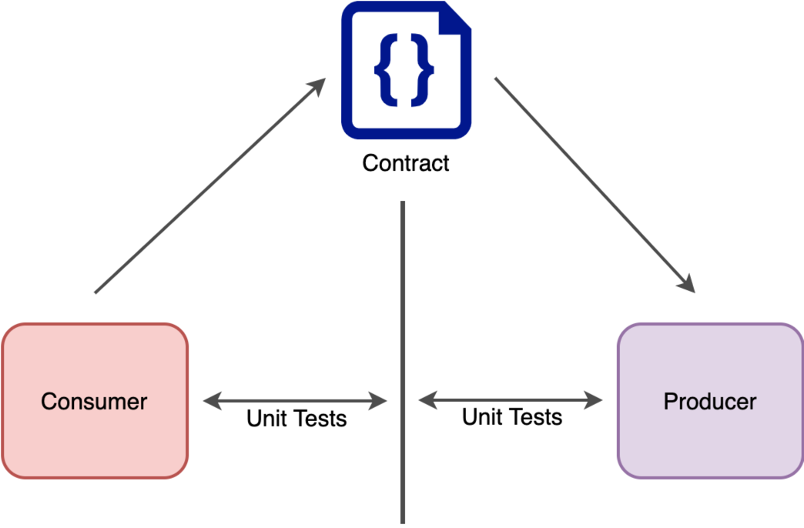
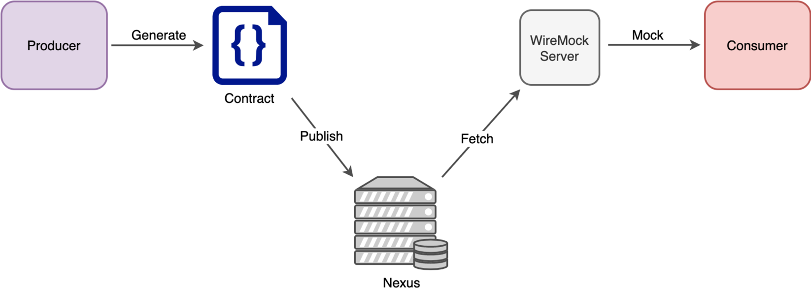
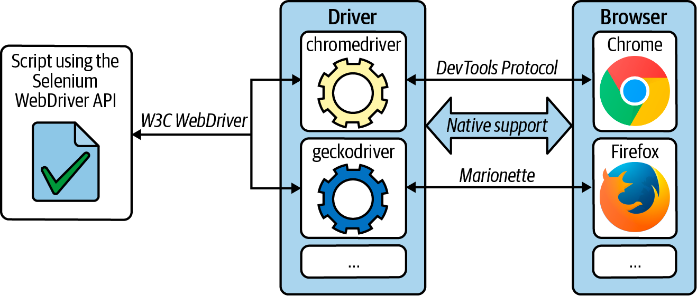
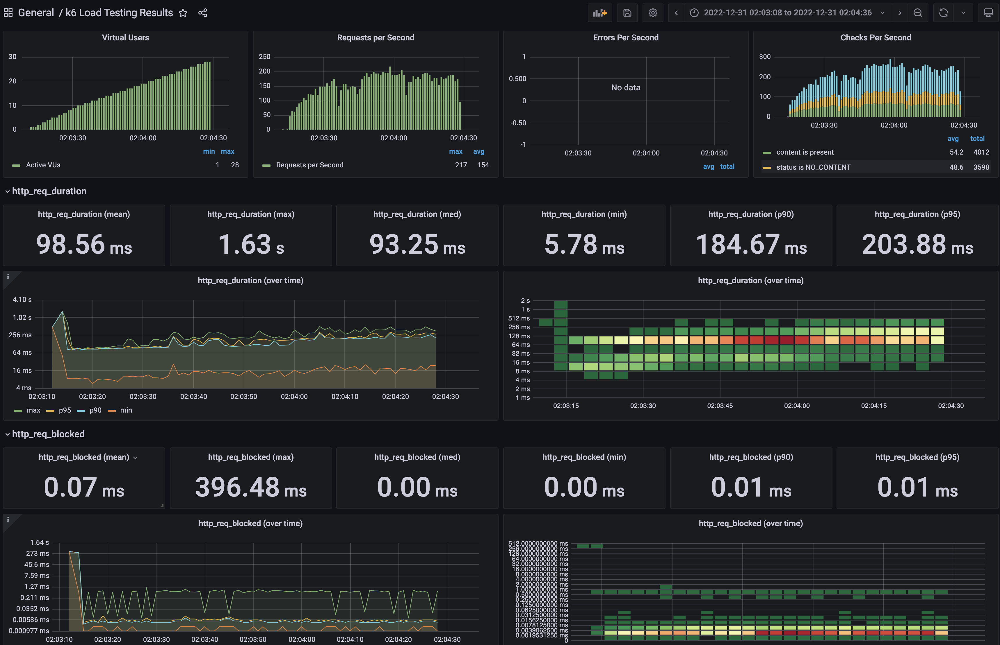

# Тестирование

## Общая теория тестирования

Тестирование – проверка соответствия реальных и ожидаемых результатов поведения программы, проводимая на конечном наборе
тестов, выбранном определённым образом.

Цель тестирования — проверка соответствия ПО предъявляемым требованиям, обеспечение уверенности в качестве ПО, поиск
очевидных ошибок в программном обеспечении, которые должны быть выявлены до того, как их обнаружат пользователи
программы.

### Принципы тестирования

1. Тестирование снижает вероятность наличия дефектов, но не гарантирует их отсутствие.
2. Полное тестирование с использованием всех входных комбинаций данных, результатов и предусловий физически
   невыполнимо (исключение — тривиальные случаи).
3. Раннее тестирование (Early testing) – следует начинать тестирование на ранних стадиях жизненного цикла разработки ПО,
   чтобы найти дефекты как можно раньше.
4. Скопление дефектов (Defects clustering) – большая часть дефектов находится в ограниченном количестве модулей, обычно
   в модулях, реализующих бизнес логику приложения.
5. Парадокс пестицида (Pesticide paradox) – если повторять те же тестовые сценарии снова и снова, в какой-то момент этот
   набор тестов перестанет выявлять новые дефекты.
6. Тестирование зависит от контекста (Testing is context depending) – тестирование проводится по-разному в зависимости
   от контекста. Например, программное обеспечение, в котором критически важна безопасность, тестируется иначе, чем
   новостной портал.
7. Заблуждение об отсутствии ошибок (Absence-of-errors fallacy) – отсутствие найденных дефектов при тестировании не
   всегда означает готовность продукта к релизу. Система должна быть удобна пользователю в использовании и удовлетворять
   его ожиданиям и потребностям.

### Градация серьезности багов

* Блокирующий (Blocker) – блокирующая ошибка, приводящая приложение в нерабочее состояние, в результате которого
  дальнейшая работа с тестируемой системой или ее ключевыми функциями становится невозможна для пользователя. Может быть
  только на prod.
* Критический (Critical) – критическая ошибка, неправильно работающая ключевая бизнес-логика, дыра в системе
  безопасности, проблема, приведшая к временному падению сервера или приводящая в нерабочее состояние некоторую часть
  системы, то есть не работает важная часть одной какой-либо функции, либо не работает значительная часть, но имеется
  workaround (обходной путь/другие входные точки), позволяющий продолжить работу.
* Значительный (Major) – не работает важная часть одной какой-либо функции/бизнес-логики, но при выполнении
  специфических условий, либо есть workaround, позволяющий продолжить работу, либо не работает не очень значительная
  часть какой-либо функциональности. Также относится к дефектам с высокими visibility – обычно не сильно влияющие на
  функциональность дефекты дизайна, которые, однако, сразу бросаются в глаза.
* Незначительный (Minor) – часто ошибки GUI, которые не влияют на функциональность, но портят usability или внешний вид.
  Также незначительные функциональные дефекты, либо которые воспроизводятся на определенном устройстве.
* Тривиальный (Trivial) – почти всегда дефекты на GUI — опечатки в тексте, несоответствие шрифта и оттенка и т.п., либо
  плохо воспроизводимая ошибка, не касающаяся бизнес-логики, проблема сторонних библиотек или сервисов, проблема, не
  оказывающая никакого влияния на общее качество продукта.

### Виды тестирования


* Unit-тесты – проверка отдельного класса программы.
* Сервисные тесты (Component Tests) – проверка, что изолированная система работает корректно (т.е. все внешние вызовы
  закрыты заглушками).
* Интеграционные тесты (Integration Tests) – тестирование контура с реальными запросами и ответами между системами.
* UI-тесты – проверка работы пользовательского интерфейса.
* Security tests – тестирование, направленное на выявление дырок в безопасности системы (как на уровне самого
  приложения, для уверенности в том, что эти изменения не внесли ошибки в областях, которые не подверглись изменениям.
  приложения, так и на уровне инфраструктуры).
* Регрессионное тестирование – тестирование уже проверенной ранее функциональности после внесения изменений в код
* Нагрузочные тесты (стресс-тесты) – тестирование поведения системы под возрастающей нагрузкой.

Методы тестирования:

* Метод белого ящика – тестирование, которое учитывает внутренние механизмы программы, обычно включает тестирование
  ветвей, маршрутов, операторов (т.е. практически всегда это unit-тесты, реже интеграционное тестирование). При
  тестировании подбирают входные параметры и определяют выходные параметры. Этот метод тестирования не может выявить
  невыполненные части спецификации.
* Метод черного ящика – также известное как тестирование, основанное на спецификации или тестирование поведения —
  техника тестирования, основанная на работе исключительно с внешними интерфейсами тестируемой системы (обычно это
  функциональное тестирование).
* Метод серого ящика – метод тестирования ПО, который предполагает комбинацию White Box и Black Box подходов. То есть,
  внутреннее устройство программы нам известно лишь частично.

### Терминология

* mock – замена реального объекта некоторой заглушкой, который мы задаем нужное нам поведение;
* spy – обертка над реальным объектом для контроля его выполнения.

## Unit тесты

Unit-тесты – важная составляющая программы, которая гарантирует работоспособность каждой части программы в отдельности.
Главной задачей unit тестов является гарантия того, что при изменении кода результат его работы остается прежним, либо
мы получаем новый ожидаемый результат. Т.к. unit-тесты в первую очередь нужны при рефакторинге и развитии кода, они не
дают гарантии работоспособности всей системы в целом.

Другими словами, если мы изменили поведение метода, то unit тесты должны упасть. Если же мы сделали внутренние
изменения (например, изменили алгоритм на более оптимальный), то unit тесты должны оставаться зелеными. На этом строится
методология TDD (Test Driven Design), где мы сначала описываем каркас системы и пишем на него тесты, которые падают, а
потом реализуем эти методы и делаем тесты зелеными.

Unit тесты тестируют методом белого ящика, т.к. мы знаем внутреннюю реализацию метода.

### Как писать unit тесты

Рассмотрим класс `UserServiceImpl` с методом `createUserWithWallet` создания пользователя и кошелька, обсудим что нужно
тестировать. В классе будет использовать MapStruct для маппинга `@Entity` -> DTO (Data Transfer Object).

```java

@Service
@RequiredArgsConstructor
public class UserServiceImpl
        implements UserService {
    private final UserRepository userRepository;
    private final UserMapper userMapper;
    private final WalletSerice walletSerice;

    @Override
    @Transactional
    public UserReponse createUserWithWallet(@NotNull CreateUserRequest request) {
        User user = new User()
                .setUserName(request.getUserName())
                .setAddress(request.getAddress());
        user = userRepository.save(user);

        final Wallet wallet = walletSerice.createWalletForUser(request, user);
        user.setWallet(wallet);

        return userMapper.toModel(user);
    }
}
```

При написании теста на метод `createUserWithWallet` мы видим две внешние зависимости: `userMapper` и `walletService`.
Класс `WalletService` принадлежит _другой_ доменной области, а значит его поведение некорректно тестировать в рамках
метода `createUserWithWallet`, т.к. в unit тестах нас не интересует корректность поведения других сервисов, отличных от
тестируемого, соответственного вместо `WalletService` мы вправе использовать заглушку.

С вызовом метода `userMapper.toModel(user)` все сложнее, т.к. это сгенерированный с помощью `MapStruct` маппер,
который `@Entity` преобразует в DTO через getter/setter на объектах. Заменять его mock в тестах не нужно, т.к. эта
функциональность является частью бизнес процесса класса. Раньше эти мапперы описывались в самом же классе как `private`
метод, фактически MapStruct забрал на себя необходимость писать это руками, а значит это можно рассматривать как часть
процесса выполнения основной доменной бизнес-логики.

Для того чтобы тесты было проще писать, нужно чтобы проверяемый класс отвечал только за свою функциональность и не делал
ничего больше, т.е. следовал принципу Single Responsibility. Если класс выполняем множество различных действий, то тест
получится большим и тяжело поддерживаемым, т.к. будет большим и зависеть от большого числа компонентов.

Нужно писать _чистые_ unit тесты на один метод в сервисе, без взаимодействия с другими классами и без поднятия контекста
приложения (например `ApplicationContext` в Spring), т.к. таких тестов будет много и они должны быть быстрыми. Так же
для каждого метода нужно проверять кроме _happy way_ еще и граничные и невалидные значения. Т.к. мы знаем реализацию
метода и понимаем, что он может принимать на вход и, соответственно, что получим на выходе, мы можем описать эт пары
значений. Для тестов на более высоком уровне абстракции это будет сделать намного сложнее, т.к. количество пар
входных-выходных параметров будет значительно больше и эти тесты будут проходить дольше, т.к. требуют подготовительных
действий.

### Тестирование Базы данных

Как мы сказали выше, unit тесты отвечают за контролируемые изменения в коде и являются максимально атомарными. Следующей
ступенью в пирамиде тестирования являются сервисные тесты – т.е. тесты, которые тестируют _изолированный_ сервис
целиком, но все внешние взаимодействия закрыты заглушками. Т.к. мы тестируем сервис целиком, нам нужно поднять все его
служебные зависимости и замокировать внешние вызовы.

#### In-memory Database

Самым простым решением для тестирования базы данных является in-memory база данных, которая хранит данные в памяти,
поддерживает базовый синтаксис SQL92 и подключается просто как зависимость в ваш код (например, как jar).

Такая база данных не требует настройки, но обычно имеет ограниченный функционал, и, например, если вы используете
что-то, что не входит в SQL92, вам этот вариант не подойдет. Плюс, ее поведение может отличаться от полноценной базы
данных, т.е. нагрузочное тестирование или сложные многопоточные тесты на ней проводить нельзя.

#### TestContainers

Если in-memory решения не подходят, то логично запускать необходимое окружение через docker. Для этого создан
проект [TestContainers](https://www.testcontainers.org/) (основная реализация на Java для JUnit, но есть порты на другие
языки) – он запускает docker контейнеры ровно на время работы тестов и гасит их сразу же, как тесты завершатся.

Т.е. мы используем движок для unit тестов, но уже тестируем не отдельный метод, а поднимаем все наше приложение и с
помощью TestContainers через docker поднимаем базы данных, очереди, хранилища типа Redis и т.п. Мы указываем
TestContainers имя образа и при старте тестов он вытягивает их из Docker Registry и запускает, а по окончанию выключает
и удаляет.

Помимо основного контейнера, который мы указываем в тестах, TestContainers использует еще два образа:

* [`alpine`](https://hub.docker.com/_/alpine) – используется для проверки, что образы могут быть затянуты из Docker
  Registry.
* [`testcontainers/ryik`](https://hub.docker.com/r/testcontainers/ryuk) – привилегированный образ, который в течение 10
  секунд после завершения теста удаляет оставшиеся контейнеры / сети / volumes / образы. Для его использования требуется
  возможность запускать privileged образы и это может не работать на некоторых CI/CD. Его можно отключить переменную
  окружения `TESTCONTAINERS_RYUK_DISABLED=true`, он используется только для удаления зависших образов при некорректном
  завершении тестов.

#### WireMock

Так же нужно создать заглушки на внешние запросы, т.е. поднять какой-то _внешний_ сервис, который для определенного
набора данных в запросах будет отдавать конкретные ответы.

Для этого используется [WireMock](https://wiremock.org/) – это инструмент для мокирования API. По своей сути это
веб-сервер, который можно настроить для обслуживания готовых ответов на определенные запросы (заглушки). Он может быть
развернут как standalone или docker образ, или конфигурироваться программно в unit тестах.

WireMock настраивается с помощью stubs: описание заглушек (_request_ / _response_) в формате json:

```json
{
  "id": "6cb49ff0-08cc-4452-b855-a9369e0c4cd9",
  "description": "Make an order",
  "request": {
    "url": "/api/v1/items/0acd5fa2-76aa-4189-b525-5b7d16aa2a1f/take",
    "method": "POST",
    "headers": {
      "Content-Type": {
        "equalTo": "application/json"
      }
    },
    "bodyPatterns": [
      {
        "matchesJsonPath": "$.['itemsUid'][?(@ == '667c15c8-09eb-4a53-8d4c-69ce70ba2ba9')]"
      },
      {
        "matchesJsonPath": "$.['itemsUid'][?(@ == '61b6fff3-6192-4488-8622-3bd6402ee49f')]"
      }
    ]
  },
  "response": {
    "status": 201,
    "body": "{\"orderUid\":\"{{{request.path.[3]}}}\",\"state\":\"CREATED\",\"items\":[{\"name\":\"Lego Technic 42\\\\d{3}\",\"itemUid\":\"{{{jsonPath request.body '$.itemsUid[0]'}}}\"},{\"name\":\"Lego Technic 42\\\\d{3}\",\"itemUid\":\"{{{jsonPath request.body '$.itemsUid[1]'}}}\"}]}",
    "headers": {
      "Content-Type": "application/json"
    }
  },
  "uuid": "6cb49ff0-08cc-4452-b855-a9369e0c4cd9"
}
```

Mock API сервер можно использовать для решения следующих задач:

* Тесты покрывают не все возможные варианты ответов сервиса: не всегда есть возможность получить некоторые ответы от
  реального веб-сервиса и промоделировать все рабочие ситуации — следовательно, максимально полно протестировать
  взаимодействие.
* Не всегда можно воспроизвести нестандартные ситуации с реальным веб-сервисом, например эмуляция различных ошибок в
  HTTP протоколе, эмуляция задержки на уровне сетевого соединения.
* Доступ к рабочим веб-сервисам может быть ограничен, например рабочие сервисы недоступны из тестового контура, в
  котором программисты ведут разработку. Это делается как по причине безопасности, так и для того, чтобы не подвергать
  лишней нагрузке рабочее окружение.
* Из-за ошибок разработки могут быть подвергнуты риску реальные данные: например, есть веб-сервисы, которые позволяют
  добавлять или изменять данные в удаленной системе. Ошибка при вызове такого сервиса может привести к потере данных.
* Тестовые данные, которые используются в тест-кейсах не всегда имеют постоянность на том или ином сервисе, и если нет
  возможности достать данные из какой-нибудь базы данных, то приходится постоянно поддерживать данные тесты в актуальном
  состоянии.

### Контрактные тесты

Описание заглушек помогает сделать стабильные сервисные тесты, но тут кроется две проблемы:

* Создание заглушек для внешних вызовов не имеет ничего общего с реальным миром, т.е. нет гарантии, что поведение,
  которое описано в mock соответствует поведению сервиса.
* Тесты могут пройти на заглушках, но развалиться на production, потому что использованные заглушки не гарантируют что
  сервер так работает.

Для решения этой проблемы, нам нужно получить описание поведения от сервиса, взаимодействие с которым мы закрываем
заглушкой.

Здесь вводится понятие контракта – декларативного описания поведения сервиса с набором входных и выходных данных. Для
подтверждения реализации контракта на сервере пишутся _сервисные_ тесты, которые входные / выходные параметры берут из
описания контракта. На клиенте этот контракт используется как mock, но в данном случае его валидность подтверждена
тестами на сервере.

Изначально подход CDD (Contract Driven Development) строится на том, что клиент описывает контракт и предоставляет его
серверу для реализации. Для реализации используется [Pact](https://docs.pact.io/).



В экосистеме Spring Boot идея CDD повернута в другую сторону и контракты описываются на сервере, по ним генерируются
тесты и результат прогона оборачивается в stubs для WireMock. Ниже приведен пример контракта, по которому сгенерирована
заглушка для WireMock из примера выше.



```kotlin
contract {
    description = "Make an order"
    request {
        url = url("/api/v1/items/$orderUid/take")
        method = POST
        headers { header(CONTENT_TYPE, APPLICATION_JSON) }
        body = body(mapOf("itemsUid" to listOf(legoTechnic42082ItemUid, legoTechnic42115ItemUid)))
    }
    response {
        status = CREATED
        headers { header(CONTENT_TYPE, APPLICATION_JSON) }
        body = body(
            mapOf(
                "orderUid" to fromRequest().path(3),
                "state" to "CREATED",
                "items" to listOf(
                    mapOf(
                        "name" to ConsumerUtils.anyLegoTechnic(),
                        "itemUid" to fromRequest().body("$.itemsUid[0]")
                    ),
                    mapOf(
                        "name" to ConsumerUtils.anyLegoTechnic(),
                        "itemUid" to fromRequest().body("$.itemsUid[1]")
                    )
                )
            )
        )
    }
}
```

Важно понимать, что сервисные тесты вам не заменят интеграционные тесты полностью, но будут хорошим дополнением к ним.
Они повысят вам качество кода и первый же запрос не будет ломать всю вашу систему, потому что кто-то забыл рассказать
что, поменял API.

## Интеграционные тесты

Движемся выше по пирамиде тестирования: теперь нам нужно протестировать всю нашу систему целиком в интеграции друг с
другом. Т.е. мы больше не мокируем никакие части системы, а используем полноценный стенд с развернутой инфраструктурой.
Единственным исключением могут быть моки на внешние интеграции, но здесь стоит помнить, что т.к. внешняя система не
находится под вашим контролем, моки могут устареть или стать неактуальными, а вы об этом узнаете только на prod.

Говоря про интеграционные тесты, стоит упомянуть несколько важных моментов:

* Ручное тестирование – это хорошо, но в микросервисной архитектуре очень дорого и долго, следовательно, все end-to-end
  сценарии должны быть автоматизированы.
* Для автотестов желательно выделить отдельный контур, который будет поддерживаться в актуальном состоянии. Иначе, если
  тестировать на общем контуре, может получиться ситуация, что разработчики что-то изменили в системе (например,
  настройки обработки платежей, чтобы отклонять платежи свыше 1000$, а у вас в тестах есть сценарии, где оплата выше
  1000$), система продолжает работать корректно, но тесты ожидают другой результат. В такой ошибке будет достаточно
  тяжело разобраться, потому что не сразу будет понятно что проблема в настройках.
* В идеальном мире при завершении задачи создается Pull Request, для него автоматически поднимается контур (кластер k8s,
  виртуальные сервера с помощью terraform и т.п.), на него накатываются _подготовленные_ тестовые данные и на нем
  прогоняются тесты. Если все тесты прошли успешно, то контур останавливается и удаляется, если нет, то создается задача
  для разбора в ошибках.
* Тестовый контур должен быть идентичен контуру разработки, чтобы не столкнуться с ошибками вида: "запрос падает по
  таймауту во время тестов, но те же самые запросы на dev выполняются успешно".

## Тесты на UI

Двигаемся выше по пирамиде и переходим к user end-to-end тестам, или тестам на UI. Здесь нам нужно эмулировать работу
пользователя в браузере (мобильном приложении), а значит нам нужен инструмент, который сможет коммуницировать UI.

Самым распространенным решением является [Selenium WebDriver](https://www.selenium.dev/documentation/webdriver/) –
библиотека для управления браузерами, представляет собой семейство драйверов для разных браузеров (Firefox, Edge, Google
Chrome, ect.) и набор клиентских библиотек на разных языках программирования для работы с драйверами. WebDriver напрямую
отправляет команды браузеру, используя его API и получает результаты тестирования.



Selenium позволяет запускать браузер локально, но, как и другие тесты, они будут приносить мало пользы, пока их запуск
не будет внедрен в CI/CD, чтобы они прогонялись на каждый commit в dev, Pull Request или других условиях.

Для решения этой проблемы используется Selenium Grid — кластер из нескольких Selenium-серверов, которые позволяют
управлять браузером удаленно по сети. Grid позволяет организовать сеть, в которой можно запускать большое количество
браузеров на большом количестве компьютеров.

Selenium Grid создает сессию на свободной ноде, подходящей под ваши критерии фильтрации, например, по версии браузера.
Он хранит информацию о том, какая сессия открыта на какой ноде и проксирует все запросы на целевую ноду, таким образом
для клиента нет разницы работать с node, или с grid.

Но у этого решения есть ряд недостатков:

* Первая проблема следует из его архитектуры: Selenium Grid хранит сессии и не умеет масштабироваться. В том числе там
  нет возможности сделать failover и если нода с Selenium Grid падает, то все тесты завершаются с ошибкой.
* При этом под нагрузкой Selenium Grid чувствует себя плохо.
* Selenium требует работу с браузером, значит требуется разворачивать полноценные виртуальные машины. VM должна быть
  достаточно мощной, чтобы тянуть современные браузеры, но фактически во время тестов потребляет не все ресурсы. Плюс VM
  нужно уметь разворачивать, устанавливать нужные браузеры и останавливать после прогона тестов.
* Но у нас нет возможности запустить несколько браузеров внутри одной VM, т.к. если браузеров больше одного, то они
  могут терять фокус (возможно уже есть решения для docker и headless режим).

Для частичного решения этих проблем используется [Selenoid](https://aerokube.com/selenoid/) – средство для запуска
тестов в docker-контейнерах. При каждом запросе на создание сессии запускается свежий контейнер, и при закрытии сессии
удаляется.

API Selenium не самое удобное и надежное, поэтому чаще для разработки тестов
используют [Selenide](https://ru.selenide.org/) – удобная и интуитивно понятная библиотека.

### Page Object Model

Page Object Model - один из наиболее полезных и используемых архитектурных решений в автоматизации. Данный шаблон
проектирования помогает инкапсулировать работу с отдельными элементами страницы, что позволяет уменьшить количество кода
и его поддержку. Если, к примеру, дизайн одной из страниц изменён, то нам нужно будет переписать только соответствующий
класс, описывающий эту страницу.

##### Простота обслуживания

POM полезен при изменении элемента пользовательского интерфейса или изменении действия. Например, выпадающее меню
заменено переключателем: в этом случае POM помогает идентифицировать страницу, которые необходимо изменить. Поскольку на
каждой страницы будет свой класс, сразу станет понятно какие классы нужно обновить. Это упрощает поддержку тестовых
случаев и уменьшает количество ошибок.

##### Повторное использование кода

Все экраны независимы: используя POM, можно использовать тестовый код для одного экрана и повторно использовать его в
другом тестовом примере. Нет необходимости переписывать код, что экономит время и усилия.

##### Читаемость и надежность сценариев

Когда все страницы описываются независимыми классами, можно быстро идентифицировать действия, выполняемые на конкретной
странице. И если необходимо внести изменения, это можно сделать эффективно, не затрагивая другие файлы.

## Нагрузочные тесты

Нагрузочное тестирование – вид тестирования, при котором проверяется стабильность и отзывчивость системы при
возрастающей нагрузке. Обычно для проведения тестирования используется инструменты, развернутые на одной или нескольких
машинах и создающие запросы к системе. При этом проверяется время отклика системы, количество обработанных запросов в
единицу времени, процент ошибок.

Для данного вида тестирования чаще всего выделяется отдельный нагрузочный стенд, _повторяющий_ копию промышленного
стенда как ресурсам, так и по объему данных.

* `Elapsed Time` (время, затраченное на обработку запроса) – полное время между отправкой запроса и получение последней
  порции данных от сервера.
* `Latency` (задержка) – время между отправкой запроса и получением первой порции данных от сервера.
* `Connect Time` (время на установку соединения) – время, затраченное на установку соединения с сервером (в том числе
  SSL handshake).
* `Throughput` (пропускная способность, RPS – request per second) – количество запросов, которое обрабатывается в
  единицу времени.
* `Median` (медианное время) – результат времени обработки, который находится посередине выборки.
* `Average` (среднее время) – среднее арифметическое время обработки запросов.
* `90% Line` (`90th Percentile`) – время, за которое укладывается 90% запросов (95%, 99%).

#### Метрики k6



#### Типы метрик

|       Название      | Описание                                                                                                 |
|:-------------------:|-------------------------------------------------------------------------------------------------------|
|   Counter (Счетчик) | Суммирующий счетчик                                                                                   |
|   Gauge(Измеритель) | Метрика, которая хранит минимальное, максимальное и последнее добавленное к ней значение              |
|         Rate (Темп) | Метрика, которая отслеживает процент ненулевых добавленных значений                                   |
|   Trend (Тенденция) | Метрика, позволяющая рассчитать статистику по добавленным значениям (мин, макс, среднее и процентили) |

#### Описание метрик

|      Название    |   Тип   | Описание                                                                                                            |
|------------------|:-------:|---------------------------------------------------------------------------------------------------------------------|
|      `vus` (Virtual Users) |   Gauge | Количество активных пользователей                                                                         |
|                `http_reqs` | Counter | Суммарное количество запросов                                                                             |
|         `http_req_blocked` |   Trend | Время, затраченное на блокировку (ожидание свободного слота TCP-подключения) перед инициированием запроса |
|      `http_req_connecting` |   Trend | Время, затраченное на установление TCP-соединения с удаленным хостом                                      |
| `http_req_tls_handshaking` |   Trend | Время, затраченное на подтверждение сеанса TLS с удаленным хостом                                         |
|         `http_req_sending` |   Trend | Время, потраченное на отправку данных на удаленный хост                                                   | 
|         `http_req_waiting` |   Trend | Время ожидания ответа от удаленного хоста                                                                 | 
|       `http_req_receiving` |   Trend | Время, потраченное на получение данных ответа от удаленного хоста                                         |
|        `http_req_duration` |   Trend | Суммарное время запроса: `http_req_sending` + `http_req_waiting` + `http_req_receiving`                   |

## Литература

1. [Testcontainers: Год спустя](https://www.youtube.com/watch?v=xgZ8KyUDjvQ)
2. WireMock – швейцарский нож в арсенале тестировщика.
    * [Часть 1](https://habr.com/ru/company/rostelecom/blog/679276/)
    * [Часть 2](https://habr.com/ru/company/rostelecom/blog/679330/)
3. [Использование паттерна Page Object](https://kreisfahrer.gitbooks.io/selenium-webdriver/content/page_object_pattern_arhitektura_testovogo_proekta/ispolzovanie_patterna_page_object.html)
4. [Несколько советов по созданию page object классов здорового человека](https://habr.com/ru/company/otus/blog/494106/)
5. [Understanding Your Reports: Part 3 - Key Statistics Performance Testers Need to Understand](https://www.blazemeter.com/blog/understanding-your-reports-part-3-key-statistics-performance-testers-need-understand)
6. [Selenoid — сотни параллельных UI-тестов легко и быстро](https://habr.com/ru/post/493626/)
7. [Как выполнять много UI-тестов параллельно, используя Selenium Grid?](https://habr.com/ru/company/avito/blog/352208/)
