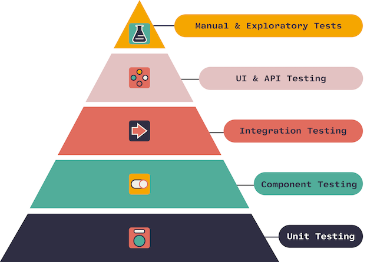

# Тестирование

## Общая теория тестирования

Тестирование – проверка соответствия реальных и ожидаемых результатов поведения программы, проводимая на конечном наборе
тестов, выбранном определённым образом.

Цель тестирования — проверка соответствия ПО предъявляемым требованиям, обеспечение уверенности в качестве ПО, поиск
очевидных ошибок в программном обеспечении, которые должны быть выявлены до того, как их обнаружат пользователи
программы.

### Принципы тестирования

1. Тестирование снижает вероятность наличия дефектов, но не гарантирует их отсутствие.
1. Полное тестирование с использованием всех входных комбинаций данных, результатов и предусловий физически
   невыполнимо (исключение — тривиальные случаи).
1. Раннее тестирование (Early testing) – следует начинать тестирование на ранних стадиях жизненного цикла разработки ПО,
   чтобы найти дефекты как можно раньше.
1. Скопление дефектов (Defects clustering) – большая часть дефектов находится в ограниченном количестве модулей, обычно
   в модулях, реализующих бизнес логику приложения.
1. Парадокс пестицида (Pesticide paradox) – если повторять те же тестовые сценарии снова и снова, в какой-то момент этот
   набор тестов перестанет выявлять новые дефекты.
1. Тестирование зависит от контекста (Testing is context depending) – тестирование проводится по-разному в зависимости
   от контекста. Например, программное обеспечение, в котором критически важна безопасность, тестируется иначе, чем
   новостной портал.
1. Заблуждение об отсутствии ошибок (Absence-of-errors fallacy) – отсутствие найденных дефектов при тестировании не
   всегда означает готовность продукта к релизу. Система должна быть удобна пользователю в использовании и удовлетворять
   его ожиданиям и потребностям.

### Градация серьезности багов

* Блокирующий (Blocker) – блокирующая ошибка, приводящая приложение в нерабочее состояние, в результате которого
  дальнейшая работа с тестируемой системой или ее ключевыми функциями становится невозможна для пользователя. Может быть
  только на prod.
* Критический (Critical) – критическая ошибка, неправильно работающая ключевая бизнес-логика, дыра в системе
  безопасности, проблема, приведшая к временному падению сервера или приводящая в нерабочее состояние некоторую часть
  системы, то есть не работает важная часть одной какой-либо функции, либо не работает значительная часть, но имеется
  workaround (обходной путь/другие входные точки), позволяющий продолжить работу.
* Значительный (Major) – не работает важная часть одной какой-либо функции/бизнес-логики, но при выполнении
  специфических условий, либо есть workaround, позволяющий продолжить работу, либо не работает не очень значительная
  часть какой-либо функциональности. Также относится к дефектам с высокими visibility – обычно не сильно влияющие на
  функциональность дефекты дизайна, которые, однако, сразу бросаются в глаза.
* Незначительный (Minor) – часто ошибки GUI, которые не влияют на функциональность, но портят usability или внешний вид.
  Также незначительные функциональные дефекты, либо которые воспроизводятся на определенном устройстве.
* Тривиальный (Trivial) – почти всегда дефекты на GUI — опечатки в тексте, несоответствие шрифта и оттенка и т.п., либо
  плохо воспроизводимая ошибка, не касающаяся бизнес-логики, проблема сторонних библиотек или сервисов, проблема, не
  оказывающая никакого влияния на общее качество продукта.

### Виды тестирования



* Unit-тесты – проверка отдельного класса программы.
* Сервисные тесты (Component Tests) – проверка, что изолированная система работает корректно (т.е. все внешние вызовы
  закрыты заглушками).
* Интеграционные тесты (Integration Tests) – тестирование контура с реальными запросами и ответами между системами.
* UI-тесты – проверка работы пользовательского интерфейса.
* Security tests – тестирование, направленное на выявление дырок в безопасности системы (как на уровне самого
  приложения, для уверенности в том, что эти изменения не внесли ошибки в областях, которые не подверглись изменениям.
  приложения, так и на уровне инфраструктуры).
* Регрессионное тестирование – тестирование уже проверенной ранее функциональности после внесения изменений в код
* Нагрузочные тесты (стресс-тесты) – тестирование поведения системы под возрастающей нагрузкой.

Методы тестирования:

* Метод белого ящика – тестирование, которое учитывает внутренние механизмы программы, обычно включает тестирование
  ветвей, маршрутов, операторов (т.е. практически всегда это unit-тесты, реже интеграционное тестирование). При
  тестировании подбирают входные параметры и определяют выходные параметры. Этот метод тестирования не может выявить
  невыполненные части спецификации.
* Метод черного ящика – также известное как тестирование, основанное на спецификации или тестирование поведения —
  техника тестирования, основанная на работе исключительно с внешними интерфейсами тестируемой системы (обычно это
  функциональное тестирование).
* Метод серого ящика – метод тестирования ПО, который предполагает комбинацию White Box и Black Box подходов. То есть,
  внутреннее устройство программы нам известно лишь частично.

### Терминология

* mock – замена реального объекта некоторой заглушкой, который мы задаем нужное нам поведение;
* spy – обертка над реальным объектом для контроля его выполнения.

## Unit тесты

Unit-тесты – важная составляющая программы, которая гарантирует работоспособность каждой части программы в отдельности.
У нас есть [сервис](src/main/java/ru/digitalhabbits/sbt/service/UserServiceImpl.java):

```java

@Service
@RequiredArgsConstructor
public class UserServiceImpl
        implements UserService {
    private final UserMapper userMapper;
    private final UserRepository userRepository;
    private final NotificationService notificationService;

    ...

    @Override
    @Transactional
    public UserInfoResponse createUser(CreateUserRequest request) {
        User user = new User()
                .setFirstName(request.getFirstName())
                .setMiddleName(request.getMiddleName())
                .setLastName(request.getLastName())
                .setAge(request.getAge());

        user = userRepository.save(user);
        notificationService.notify(EventType.CREATED, user.toString());

        return userMapper.toModel(user);
    }
    
    ...
}
```

В нем есть метод `createUser` – создание нового пользователя. Метод состоит из вызова `userRepository.save(...)` – слой
работы с базой данных и вызова другого сервиса `notificationService.notify(...)`. Для unit-тестирования нас _не
интересует_ корректность поведения других сервисов, мы проверяем логику работы `UserService`, а вызовы в другие сервисы
мы мокируем. Корректность работы других сервисов мы проверяем в соответствующих unit-тестах. В результате мы получаем
гарантию, что каждый сервис работает корректно в случае, если корректно работают сервисы, которые он вызывает.
Unit-тесты не дают гарантию, что система работает корректно (!), но они дают _надежду_, что при рефакторинге поведение
изменяемых классов остается корректным.

Для того чтобы тесты было проще писать, нужно чтобы проверяемый класс отвечал только за свою функциональность и не делал
ничего больше, т.е. следовал принципу Single Responsibility. Если класс выполняем множество различных действий, то тест
получится большим и тяжело поддерживаемым, т.к. будет большим и зависить от большого числа компонентов.

### Тестирование Базы данных

### Контрактные тесты

## Нагрузочные тесты

## Тесты на UI

## Литература

1. [Understanding Your Reports: Part 3 - Key Statistics Performance Testers Need to Understand](https://www.blazemeter.com/blog/understanding-your-reports-part-3-key-statistics-performance-testers-need-understand)
2. [Несколько советов по созданию page object классов здорового человека](https://habr.com/ru/company/otus/blog/494106/)