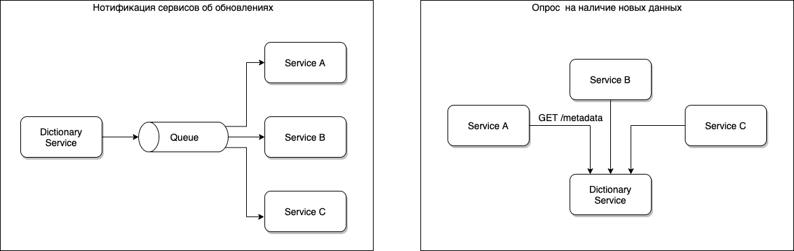

# Организация работы с данными

## Как работать со справочной информацией

В любой достаточно большой системе со временем возникает необходимость хранить некоторую справочную информацию.
Справочная информация – это данные, который поступают в систему не через пользовательский ввод. Обычно эти данные
меняются редко.

Справочниками могут быть например:

* регионы России;
* телефонные коды городов;
* справочник улиц и домов (обычно эта справочная информация синхронизируются со внешними источниками).

Стоит отметить, что _небольшие_ и редко изменяемые справочные данные удобнее хранить прямо в коде как константы.
Например:

* пол (`Male`, `Female`);
* день недели (`Monday`, `Tuesday`, `Wednesday`, `Thursday`, `Friday`, `Saturday`, `Sunday`);
* статус задачи (статусы могут меняться только при доработках в коде, а значит новые статусы появятся только во время
  релиза).

Рассмотрим варианты хранения справочной информации.

### Хранение данных в коде

Самый простой способ хранить справочники – добавлять их прямо в код как `property` / `yaml` файлы. Этот вариант может
быть удобен, когда справочная информация меняется _очень редко_ и у пользователя _нет возможности_ ее редактировать.
Если потребуется изменить данные при такой архитектуре хранения, то придется залезать в каждый сервис и там обновлять
эти файлы.

Из плюсов можно выделить:

* простота хранения и легкость использования.

Из минусов:

* сложность обновления;
* отсутствие возможности редактирования пользователем;
* использование внешней справочной информации невозможно;
* большие объемы данных (> 10Mb) хранить затруднительно (с такими файлами сложно работать эти данные хранятся в памяти).

### Хранение справочной информации в базе данных

Следующим логичным способом будет перенесение этих данных из статических файлов в базу данных каждого сервиса. Здесь мы
частично решаем проблемы, описанные выше:

* простота хранения и легкость использования;
* при использовании SQL появляется большая гибкость в получении данных;
* можно хранить большие объемы данных.

Но получаем более серьезные проблемы с поддержкой:

* данные можно обновлять только через скрипты миграции _на каждом сервисе_;
* пользовательское обновление крайне затруднительно, т.к. для данных нет мастер системы;
* для работы со внешней справочной информацией, требуется реализовать логику обновления на каждом сервисе;
* сложнее поддерживать консистентность справочников, потому что данные не на виду.

### Сервис справочников

При хранении справочников в каждой системе в своей базе данных появляются большие проблемы, описанные выше. Логично
предположить, что часть из них уйдет, если использовать для всех сервисов общую базу данных. Но так _делать нельзя_,
потому что мы получаем связность по данным, а это приведет огромным затруднениям при развитии системы.

Поэтому логично выделить отдельный сервис, который будет работать со справочниками, а все системы у него будут получать
актуальную информацию.

Плюсы такого подхода:

* появляется мастер система, которая является источником данных;
* можно хранить большие объемы данных;
* можно использовать любое хранилище данных, например NoSQL или графовые базы данных;
* т.к. есть точка истины, то становится возможным обновление данных пользователем через API сервиса;
* этот сервис может обслуживать как внутренние, так и внешние справочники, занимаясь их синхронизацией со внешними
  источниками.

После того как мы выделили Систему Справочников, нам нужно чтобы все остальные системы хранили актуальную копию
необходимой им справочной информации у себя. Это можно сделать двумя путями: справочники рассылают события обновления
или сервисы сами опрашивают сервис справочников о наличии новых данных.

Важно отметить, что другие системы не хранят у себя справочную информацию, а просто держат в памяти. Если сервис
перезапустился, то он просто запрашивает весь справочник.

##### Обновление через опрос состояния

Для каждого справочника выделяется отдельное API, если сервису нужны данные этого справочника, он сам опрашивает его о
наличии обновлений. Чтобы не возникало необходимости каждый раз выполнять запрос к Сервису Справочников, можно
использовать локальное кэширование. Этот кэш может быть локальным, т.к. получаемые данные на каждом _instance_
приложения одинаковые.

Из минусов такого подхода можно отметить:

* системы получают обновленные данные справочников с некоторой задержкой, т.к. опрос выполняется раз в 5/10/30 минут
  (делать интервал между запросами маленьким не стоит, т.к. это лишняя нагрузка на Сервис Справочников);
* может случиться ситуация, что один _instance_ получил обновленные данные, а второй еще нет. Это может привести к
  неконсистентности обрабатываемых данных, например: на первом _instance_ уже есть данные о новом курсе валют, а другой
  _instance_, который еще не получил эту информацию, будет обрабатывать платежный запрос по старому курсу, что может
  привести к некорректной сумме оплаты.

##### Широковещательное событие об обновлении справочника

Более сложный вариант актуализации справочников – это получение данных через широковещательное событие в очереди. Здесь
появляется ряд важных преимуществ:

* все сервисы получают актуальные обновления одновременно;
* нет лишней нагрузки на Сервис Справочников;

Но и возникают недостатки:

* нужна гарантия, что все сервисы получили и _корректно_ обработали событие обновления;
* появляется необходимость использовать очередь (а значит затраты на ее настройку и эксплуатацию в prod).

## Как реализовать отчетную систему

Следующим важным вопросом при проектировании распределенных систем является выделение Сервиса Отчетов.

В какой-то момент появляется необходимость построения агрегированных отчетов, данные для которых хранятся в разных
сервисах.

##### Сбор данных в момент построения отчета

На первом этапе эти отчеты можно строить в системе, где больше всего данных, а за всеми необходимыми данные делать
запрос к другим системам. Этот вариант удобный, т.к. нет необходимости выделять дополнительную систему, но при росте
объема данных и сложности запросов он быстро упрется в производительность, т.к. скорее всего будет содержать большое
количество `join`.

Самым производительной структурой данных для SQL запросов будет плоская денормализованная таблица.

##### Отправка данных в момент выполнения операции

Если у вас выделен Отчетный Сервис, то данные для построения отчетов должны быть _уже в нем_. Т.е. получается что при
построении отчета не Сервис Отчетов ходит по всем системам и набирает данные, а каждый сервис при выполнении операций
самостоятельно отправляет ему данные.

Обычно это подготовленные (агрегированные на отправителе) данные, отправляемые через очередь. Т.к. отчеты часто носят
статистический характер, здесь нет жесткого требования гарантии доставки.

### Хранилище данных

Обычно когда возникает явная необходимость в Сервисе Отчетов, текущее решение на базе SQL запросов уже не справляется с
объемом данных и требуется помимо самой системы еще выбрать систему хранения.

##### Реляционные базы данных

Самый простой способ – это использование денормализованной таблицы со всеми данными, а значит можно использовать всю
мощь SQL.

Но огромной проблемой такого решения является то, что при необходимости добавить новые столбцы в эту таблицу, из-за ее
объема сделать это через обычный `ALTER TABLE ... ADD COULM ...` невозможно и требуется делать редактирование DDL через
миграцию в новую структуру данных.

##### NoSQL

Главной особенностью реляционных баз данных является транзакционность – способность _целиком_ выполнять набор команд или
отменять изменения в случае ошибки, не нарушая консистентность данных.

Но т.к. мы работаем с атомарными записями, у нас нет необходимости использовать транзакционность, а значит нам отлично
подойдут NoSQL решения, тем более что ввиду отсутствия ACID (транзакционности) они намного более гибкие в плане
масштабирования и миграции данных.

##### Spark + Hadoop

Для построения сложных отчетов можно использовать экосистему Hadoop и Spark как инструмент построения отчетов, но тут
возникает две больших проблемы:

* Hadoop нужно поднять и поддерживать, а это требует особых компетенций;
* Spark + Hadoop не умеют строить расчеты в реальном времени, для запуска spark сессии требуется минимум 30+ секунд.