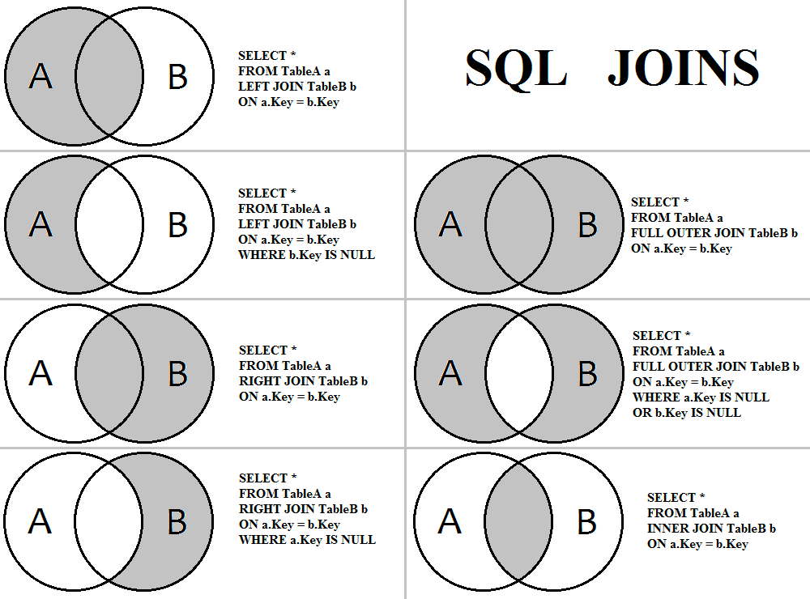
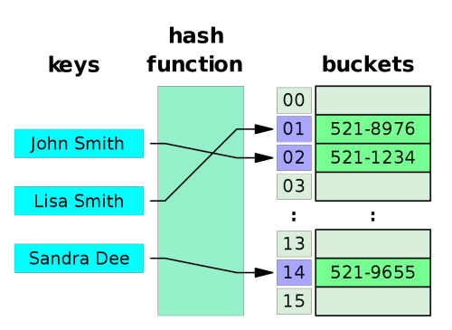

# Индексы и оптимизация SQL запросов

## JOIN



```postgresql
CREATE OR REPLACE FUNCTION random_string(length INT)
    RETURNS VARCHAR AS
$$
BEGIN
    RETURN (
        SELECT STRING_AGG(SUBSTR('ABCDEFGHIJKLMNOPQRSTUVWXYZ', CEIL(RANDOM() * 26)::INTEGER, 1), '')
        FROM GENERATE_SERIES(1, length)
    );
END;
$$ LANGUAGE plpgsql;

CREATE TABLE one
(
    id   INT PRIMARY KEY,
    name VARCHAR(80)
);

CREATE TABLE two
(
    id   INT PRIMARY KEY,
    name VARCHAR(80)
);

INSERT INTO one (id, name)
SELECT i, random_string(10)
FROM GENERATE_SERIES(1, 10) AS i;

INSERT INTO two (id, name)
SELECT i, random_string(10)
FROM GENERATE_SERIES(6, 15) AS i;
```

##### INNER JOIN

Оператор внутреннего соединения. Порядок таблиц для оператора неважен, поскольку оператор является симметричным.
Выбираются только совпадающие данные из объединяемых таблиц.

  ```postgresql
SELECT o.id   AS id1
     , t.id   AS id2
     , o.name AS name1
     , t.name AS name2
FROM one o
    INNER JOIN two t ON o.id = t.id;
```

|  #  | id1 | id2 |    name1   |    name2   |
|:---:|:---:|:---:|:----------:|:----------:|
|  1  |  6  |  6  | BGAEGCFCDG | EHFHGCDEBA |
|  2  |  7  |  7  | AECCBACDDB | GBAADAFCDH |
|  3  |  8  |  8  | BAAEGCFCEB | DAACDGGBAC |
|  4  |  9  |  9  | CDGFFDCGEH | GBEECHCEBC |
|  5  |  10 |  10 | EFGDBFBBGF | BGBDEGBGDH |

##### FULL OUTER JOIN

Такое объединение вернет данные из обеих таблиц (совпадающие по условию объединения) ПЛЮС дополнит выборку оставшимися
данными из внешней таблицы, которые по условию не подходят, заполнив недостающие данные значением `NULL`.

```postgresql
SELECT o.id   AS id1
     , t.id   AS id2
     , o.name AS name1
     , t.name AS name2
FROM one o
    FULL OUTER JOIN two t ON o.id = t.id;
```

|  #  |  id1 |  id2 |    name1   |    name2   |
|:---:|:----:|:----:|:----------:|:----------:|
|  1  |   1  | null | GGDFDCEFEC |    null    |
|  2  |   2  | null | FAGCEDAGHA |    null    |
|  3  |   3  | null | CCGEGGDCDG |    null    |
|  4  |   5  | null | AGCCCFHAAF |    null    |
|  5  |   5  | null | FEAGFEFGDC |    null    |
|  6  |   6  |   6  | BGAEGCFCDG | EHFHGCDEBA |
|  7  |   7  |   7  | AECCBACDDB | GBAADAFCDH |
|  8  |   8  |   8  | BAAEGCFCEB | DAACDGGBAC |
|  9  |   9  |   9  | CDGFFDCGEH | GBEECHCEBC |
|  10 |   10 |  10  | EFGDBFBBGF | BGBDEGBGDH |
|  11 | null |  11  |    null    | CAADHGHAGB |
|  12 | null |  12  |    null    | HGEHCDAFEB |
|  13 | null |  13  |    null    | HCGCCBEACH |
|  14 | null |  14  |    null    | HCGCCBEACH |
|  15 | null |  15  |    null    | GHAABBCDED |

##### LEFT / RIGHT JOIN

Работают они одинаково, разница заключается в том что `LEFT` - указывает что "внешней" таблицей будет находящаяся слева.

```postgresql
SELECT o.id   AS id1
     , t.id   AS id2
     , o.name AS name1
     , t.name AS name2
FROM one o
    LEFT JOIN two t ON o.id = t.id;
```

|  #  |  id1 |  id2 |    name1   |    name2   |
|:---:|:----:|:----:|:----------:|:----------:|
|  1  |   1  | null | GGDFDCEFEC |    null    |
|  2  |   2  | null | FAGCEDAGHA |    null    |
|  3  |   3  | null | CCGEGGDCDG |    null    |
|  4  |   5  | null | AGCCCFHAAF |    null    |
|  5  |   5  | null | FEAGFEFGDC |    null    |
|  6  |   6  |   6  | BGAEGCFCDG | EHFHGCDEBA |
|  7  |   7  |   7  | AECCBACDDB | GBAADAFCDH |
|  8  |   8  |   8  | BAAEGCFCEB | DAACDGGBAC |
|  9  |   9  |   9  | CDGFFDCGEH | GBEECHCEBC |
|  10 |   10 |  10  | EFGDBFBBGF | BGBDEGBGDH |

##### CROSS JOIN

Оператор перекрёстного соединения, или декартова произведения CROSS JOIN соединяет две таблицы. Порядок таблиц для
оператора неважен, поскольку оператор является симметричным. При использовании оператора SQL CROSS JOIN каждая строка
левой таблицы сцепляется с каждой строкой правой таблицы. В результате получается таблица со всеми возможными
сочетаниями строк обеих таблиц.

```postgresql
SELECT o.id   AS id1
     , t.id   AS id2
     , o.name AS name1
     , t.name AS name2
FROM one o
    CROSS JOIN two t;
```

|  #  |  id1 |  id2 |    name1   |    name2   |
|:---:|:----:|:----:|:----------:|:----------:|
|   1 |   1  |   6  | GGDFDCEFEC | EHFHGCDEBA |
|   2 |   1  |   7  | GGDFDCEFEC | GBAADAFCDH |
|   3 |   1  |   8  | GGDFDCEFEC | DAACDGGBAC |
|   4 |   1  |   9  | GGDFDCEFEC | GBEECHCEBC |
|   5 |   1  |  10  | GGDFDCEFEC | BGBDEGBGDH |
| ... |  ... |  ... |     ...    |     ...    |
|  96 |  10  |  11  | EFGDBFBBGF | CAADHGHAGB |
|  97 |  10  |  12  | EFGDBFBBGF | HGEHCDAFEB |
|  98 |  10  |  13  | EFGDBFBBGF | HACAHBCFHC |
|  99 |  10  |  14  | EFGDBFBBGF | GHAABBCDED |
| 100 |  10  |  15  | EFGDBFBBGF | HCGCCBEACH |

## Индексы

Индексы в PostgreSQL — специальные объекты базы данных, предназначенные в основном для ускорения доступа к данным. Это
вспомогательные структуры: любой индекс можно удалить и восстановить заново по информации в таблице. Так же индексы
служат для поддержки ограничений целостности.

Индекс устанавливает соответствие между ключом и строками таблицы, в которых этот ключ встречается. Строки
идентифицируются с помощью `TID` (Tuple ID), который состоит из номера блока файла и позиции строки внутри блока. Тогда,
зная ключ или некоторую информацию о нем, можно быстро прочитать те строки, в которых может находиться интересующая нас
информация, не просматривая всю таблицу полностью.

При любой операции над проиндексированными данными: вставка, удаление или обновление строк таблицы, — индексы, созданные
для этой таблицы, должны быть перестроены, причем в рамках той же транзакции.

Механизм индексирования участвует в выполнении запросов. Он вызывается в соответствии с планом, построенным на этапе
оптимизации. Оптимизатор, перебирая и оценивая различные пути выполнения запроса, должен понимать возможности всех
методов доступа, которые потенциально можно применить:

* Сможет ли метод доступа отдавать данные сразу в нужном порядке или надо отдельно применить сортировку?
* Можно ли применить метод доступа для поиска `null`?

```postgresql
CREATE TABLE three
(
    a INT,
    b VARCHAR(20),
    c BOOLEAN
);

INSERT INTO three(a, b, c)
SELECT s.id, CHR((32 + RANDOM() * 94)::INTEGER), RANDOM() < 0.01
FROM GENERATE_SERIES(1, 100000) AS s(id)
ORDER BY RANDOM();

CREATE INDEX idx_three_a ON three (a);
ANALYSE three;

EXPLAIN SELECT * FROM three WHERE a = 1;
```

```
Index Scan using idx_three_a on three  (cost=0.29..8.31 rows=1 width=7)
  Index Cond: (a = 1)
```

### Сканирование по битовой карте

`Bitmap Index Scan` – метод битовых индексов заключается в создании отдельных битовых карт (последовательность 0 и 1)
для каждого возможного значения столбца, где каждому биту соответствует строка с индексируемым значением, а его значение
равное 1 означает, что запись, соответствующая позиции бита содержит индексируемое значение для данного столбца или
свойства.

Сначала метод доступа возвращает все `TID`, соответствующие условию (узел `Bitmap Index Scan`), и по ним строится
битовая карта версий строк. Затем версии строк читаются из таблицы (`Bitmap Heap Scan`) — при этом каждая страница будет
прочитана только один раз. Сканирование по битовой карте позволяет избежать повторных обращений к одной и той же
странице данных.

```postgresql
EXPLAIN SELECT * FROM three WHERE a <= 100;
```

```
Bitmap Heap Scan on three  (cost=4.99..228.28 rows=90 width=7)
  Recheck Cond: (a <= 100)
  ->  Bitmap Index Scan on idx_three_a  (cost=0.00..4.97 rows=90 width=0)
        Index Cond: (a <= 100)
```

Сначала метод доступа возвращает все `TID`, соответствующие условию (узел Bitmap Index Scan), и по ним строится битовая
карта версий строк. Затем версии строк читаются из таблицы (Bitmap Heap Scan) — при этом каждая страница будет прочитана
только один раз.

Если условия наложены на несколько полей таблицы, и эти поля проиндексированы, сканирование битовой карты позволяет
использовать несколько индексов одновременно. Для каждого индекса строятся битовые карты версий строк, которые затем
побитово логически умножаются (`AND`), либо логически складываются (`OR`).

```postgresql
CREATE INDEX idx_three_b ON three (b);
ANALYSE three;

EXPLAIN SELECT * FROM three WHERE a <= 100 AND b = 'a';
```

```
Bitmap Heap Scan on three  (cost=17.18..21.19 rows=1 width=7)
  Recheck Cond: ((a <= 100) AND ((b)::text = 'a'::text))
  ->  BitmapAnd  (cost=17.18..17.18 rows=1 width=0)
        ->  Bitmap Index Scan on idx_three_a  (cost=0.00..5.06 rows=102 width=0)
              Index Cond: (a <= 100)
        ->  Bitmap Index Scan on idx_three_b  (cost=0.00..11.87 rows=1010 width=0)
              Index Cond: ((b)::text = 'a'::text)
```

### Index Only Scan

Основная задача метода доступа — вернуть идентификаторы подходящих строк таблицы, чтобы механизм индексирования мог
прочитать из них необходимые данные. Но если индекс содержит все данные, требующиеся в запросе, то оптимизатор может
применить `Index Only Scan`.

```postgresql
EXPLAIN SELECT a FROM three WHERE a <= 100;
```

```
Index Only Scan using idx_three_a on three  (cost=0.29..6.08 rows=102 width=4)
  Index Cond: (a <= 100)
```

### Sequence scan

При запросе по индексу Postgres сначала читает индекс (упорядоченный), а потом по `TID` идет к страницам и читает данные
оттуда вразнобой. При этом последовательное чтение выполняется быстрее.

Индексы работают тем лучше, чем выше селективность условия, то есть чем меньше строк ему удовлетворяет. При увеличении
выборки возрастают и накладные расходы на чтение страниц индекса.

```postgresql
EXPLAIN SELECT * FROM three WHERE a <= 40000;
```

```
Seq Scan on three  (cost=0.00..1693.00 rows=39954 width=7)
  Filter: (a <= 40000)
```

При неселективном условии оптимизатор предпочтет использованию индекса последовательное сканирование таблицы целиком.

#### [bTree](https://habr.com/ru/company/postgrespro/blog/330544/)

#### [Hash](https://habr.com/ru/company/postgrespro/blog/328280/)



Идея хеширования состоит в том, чтобы значению любого типа данных сопоставить некоторое небольшое число (0..N−1, всего N
значений). Полученное число можно использовать как индекс обычного массива, куда и складывать ссылки на строки
таблицы (`TID`). Элементы такого массива называют корзинами hash-таблицы — в одной корзине могут лежать несколько `TID`,
если одно и то же проиндексированное значение встречается в разных строках, либо если один hash-функция вернула корзину
для разных данных (коллизия). Для этого вместе с `TID` нужно хранить еще сам ключ, но экономии места сохраняется не сам
ключ, а его hash-код.

При вставке в индекс вычислим hash-функцию для ключа. Хеш-функции в Postgres всегда возвращают тип `INT`, что
соответствует диапазону 2^32, т.е. примерно 4 миллиарда значений. Число корзин изначально равно двум и увеличивается
динамически, подстраиваясь под объем данных.

Hash индексы не могут быть упорядоченными и не могут быть уникальными, т.к. могут быть коллизии.

#### [GiST](https://habr.com/ru/company/postgrespro/blog/333878/)

GiST — сбалансированное по высоте дерево, состоящее из узлов-страниц. Узлы состоят из индексных записей. Каждая запись
листового узла содержит, если говорить в самом общем виде, некий предикат (логическое выражение) и ссылку на строку
таблицы (`TID`). Индексированные данные (ключ) должны удовлетворять этому предикату.

Каждая запись внутреннего узла также содержит предикат и ссылку на дочерний узел, причем все индексированные данные
дочернего поддерева должны удовлетворять этому предикату. Иными словами, предикат внутренней записи включает в себя
предикаты всех дочерних записей. Это важное свойство, заменяющее индексу GiST простую упорядоченность B-дерева.

Поиск в дереве GiST использует специальную функцию согласованности (`consistent`) — одну из функций, определяемых
интерфейсом, и реализуемую по-своему для каждого поддерживаемого семейства операторов.

Функция согласованности вызывается для индексной записи и определяет, согласуется ли предикат данной записи с поисковым
условием (вида `индексированное-поле` -> `оператор` -> `выражение`). Для внутренней записи она фактически определяет,
надо ли спускаться в соответствующее поддерево, а для листовой записи — удовлетворяют ли индексированные данные условию.

Поиск начинается с корневого узла. С помощью функции согласованности выясняется, в какие дочерние узлы имеет смысл
заходить (их может оказаться несколько), а в какие — нет. Затем алгоритм повторяется для каждого из найденных дочерних
узлов. Если же узел является листовым, то запись, отобранная функцией согласованности, возвращается в качестве одного из
результатов.

Поиск производится в глубину: алгоритм в первую очередь старается добраться до какого-нибудь листового узла. Это
позволяет по возможности быстро вернуть первые результаты (что может быть важно, если пользователя интересуют не все
результаты, а только несколько).

#### [SP-GiST](https://habr.com/ru/company/postgrespro/blog/337502/)

Идея индексного метода SP-GiST состоит в разбиении области значений на неперекрывающиеся подобласти, каждая из которых,
в свою очередь, также может быть разбита. Такое разбиение порождает несбалансированные деревья (в отличие от B-деревьев
и обычного GiST).

Внутренний узел дерева SP-GiST хранит ссылки на дочерние узлы, для каждой ссылки может быть задана метка. Кроме того,
внутренний узел может хранить значение, называемое префиксом. На самом деле это значение не обязано быть именно
префиксом, его можно рассматривать как произвольный предикат, выполняющийся для всех дочерних узлов.

Листовые узлы SP-GiST содержат значение индексированного типа и ссылку на строку таблицы (`TID`). В качестве значения
могут использоваться сами индексированные данные (ключ поиска), но не обязательно: может храниться и сокращенное
значение. Кроме того, листовые узлы могут собираться в списки. Таким образом, внутренний узел может ссылаться не на одно
единственное значение, а на целый список.

#### [GIN](https://habr.com/ru/company/postgrespro/blog/340978/)

GIN расшифровывается как Generalized Inverted Index — обратный индекс. Он работает с типами данных, значения которых не
являются атомарными, а состоят из элементов. При этом индексируются не сами значения, а отдельные элементы, каждый
элемент ссылается на те значения, в которых он встречается.

К каждому элементу привязан упорядоченный набор ссылок на строки таблицы, содержащие значения с этим элементом.

Основная область применения метода GIN — ускорение полнотекстового поиска.

### Неиспользование индексов

* Если большая выборка, а `work_mem` маленький, то планировщик выбирает Sequence Scan по таблице.
* Если стоимость вычисления с использованием индекса будет больше, чем обычный обход таблицы. Например, если существует
  10 млн. записей, id является первичным ключом и по нему построен индекс. При
  запросе `SELECT * FROM logs WHERE id > 100` будет выполнен Sequence Scan, т.к. фильтрация по индексу даст малое
  количество отфильтрованных записей (условие не селективное, т.е. возвращается много данных), а после фильтрации нужно
  будет идти в саму таблицу за данными.
* Если в запросе фигурирует `IS NOT NULL` в условии, при этом таблица является разряженной (кол-во `NULL` полей больше
  50%), а при построении индекса не было указано, что строить только по не пустым полям, то планировщик будет
  использовать Sequence Scan. (База данных предполагает, что индексируемая колонка без `NOT NULL` охватывает слишком
  большой диапазон, чтобы быть полезным, поэтому база данных не будет вести поиск по индексу). Так же это даст очень
  большой прирост в размере индекса.
* Типы полей в запросе должны в точности совпадать с типами в индексе.
* Порядок полей в индексе важен: если индекс построен по A, B, то если в запросе фигурирует только B, то индекс не будет
  использован.

### Оптимизация

1. Если в результате запроса данные дублируются (обычно при join 1:N), то это нельзя лечить с помощью `DISTINCT`.
   `DISTINCT` делает либо сортировку (обычно), либо агрегирование через хэширование.
2. При использовании индекса можно задавать сортировку. Если индекс построен по ASC (по-умолчанию), а в запросе
   используется DESC, то данные запрашиваются с диска не последовательно, что снижает скорость работы.
3. Т.к. индексы хранятся отдельно от таблицы в системном каталоге, их можно физически вынести на отдельный носитель, тем
   самым получив параллельное чтение из индекса и из таблицы.
4. При частой перестройке индекса индекс становится фрагментированным (т.е. информация хранится не последовательно на
   диске). Для избавления от фрагментации используется команда `REINDEX`.
5. В Postgres есть параметр построения индекса `CONCURRENTLY` индекс строится в фоновом режиме не мешая операциям
   записи, но становится доступным только когда завершатся все начатые до момента окончания его построения транзакции.
   Когда он используется, Postgres должен выполнить два сканирования таблицы, а кроме того, должен дождаться завершения
   всех существующих транзакций, которые потенциально могут модифицировать и использовать этот индекс. Таким образом,
   эта процедура требует проделать в сумме больше действий и выполняется значительно дольше, чем обычное построение
   индекса. Однако благодаря тому, что этот метод позволяет продолжать обычную работу с базой во время построения
   индекса, он оказывается полезным в производственной среде.
6. Функциональный индекс (построение индекса по immutable-функции).
7. Можно в явном виде задавать hint'ы (указывать планировщику, что нужно использовать конкретный индекс).
8. Убрать пересекающиеся индексы. Индекс, построенный по A, B перекрывает индекс по A.
9. Если вы пишете хитрые запросы, скорее всего структура данных не соответствует тому, что вам нужно.
10. Если требуется сделать `JOIN` маленькой таблицы на большую таблицу, то это все может работать медленно. Можно либо
    денормализовать две таблицы в одну с осознанной избыточностью данных, либо нужные записи из маленькой таблицы
    поднять заранее и в `WHERE` передавать id в блоке `IN`.

### Оптимизация JOIN

##### Nested loop

Объединение через цикл.

```
FOR i IN first_table
    FOR j IN second_table WHERE second_table.i = i
```        

Плюсы:

* быстрый на небольших объемов данных;
* не требует много памяти;
* если по второй таблице идет сканирование по индексу, то получается быстро.

Минусы:

* плох на больших объемах данных;
* нужен индекс (что не очень дешево при обходе всей таблицы).

##### Hash Join

Строим hash-таблицу из меньшей таблицы.

```
FOR i IN second_table
    IF key_exists(hash(j))
```

Плюсы:

* не нужен индекс;

Минусы:

* нужно много памяти;
* долгое время получение первой строки (т.к. сначала требуется построение hash-таблицы).

##### Merge Join

Каждая таблица упорядочивается по колонке, по которой идет соединение. После этого последовательно сканируются две
таблицы и общие строки попадают в результат. Такого результата можно добиться, если строки соединения попадают в индекс.

## EXPLAIN

```postgresql
CREATE EXTENSION tablefunc;
-- https://explain.depesz.com/

DROP TABLE one CASCADE;
CREATE TABLE IF NOT EXISTS one
(
    a INT,
    b VARCHAR(80),
    r INT,
    f INT
);

DROP TABLE two;
CREATE TABLE two
(
    c INT,
    d BOOLEAN
);
----------------------------------------------------------------
----------------------------------------------------------------
----------------------------------------------------------------
INSERT INTO one (a, b, r, f)
SELECT i % 100, MD5(RANDOM()::TEXT), 40 + (RANDOM() * 200)::INT, normal_rand(1, 50, 10)
FROM GENERATE_SERIES(1, 1000) AS i;

ANALYSE one;

EXPLAIN SELECT * FROM one WHERE a > 50;
----------------------------------------------------------------
----------------------------------------------------------------
----------------------------------------------------------------
INSERT INTO one (a, b, r, f)
SELECT 1000 + i, MD5(RANDOM()::TEXT), 40 + (RANDOM() * 200)::INT, normal_rand(1, 50, 40)
FROM GENERATE_SERIES(1, 10) AS i;

EXPLAIN ANALYSE SELECT * FROM one;

ANALYSE one;

EXPLAIN SELECT * FROM one;
----------------------------------------------------------------
----------------------------------------------------------------
----------------------------------------------------------------
CREATE INDEX IF NOT EXISTS idx_one_a ON one (a);
EXPLAIN SELECT * FROM one WHERE a > 50;

EXPLAIN SELECT * FROM one WHERE a > 90;

EXPLAIN VERBOSE SELECT a FROM one WHERE a = 10;

CREATE INDEX IF NOT EXISTS idx_one_f ON one (f);
CREATE INDEX IF NOT EXISTS idx_one_f_a ON one (f, a);
EXPLAIN SELECT f FROM one WHERE f = 10;

EXPLAIN (ANALYSE, BUFFERS, VERBOSE )
SELECT *
FROM one
WHERE a > 700;
----------------------------------------------------------------
----------------------------------------------------------------
----------------------------------------------------------------
CREATE INDEX IF NOT EXISTS idx_one_b ON one (b);

EXPLAIN SELECT * FROM one WHERE b LIKE 'abcd%';
----------------------------------------------------------------
----------------------------------------------------------------
----------------------------------------------------------------
DROP INDEX idx_one_b;

CREATE INDEX IF NOT EXISTS idx_one_b ON one (b TEXT_PATTERN_OPS);

EXPLAIN SELECT * FROM one WHERE b LIKE 'abcd%';
----------------------------------------------------------------
----------------------------------------------------------------
----------------------------------------------------------------
EXPLAIN ANALYSE SELECT * FROM one ORDER BY a;

DROP INDEX idx_one_a;

EXPLAIN SELECT * FROM one ORDER BY a;
EXPLAIN ANALYSE SELECT * FROM one ORDER BY a;
----------------------------------------------------------------
----------------------------------------------------------------
----------------------------------------------------------------
-- sudo sync && purge
EXPLAIN (ANALYSE, BUFFERS, VERBOSE) SELECT * FROM one;
----------------------------------------------------------------
----------------------------------------------------------------
----------------------------------------------------------------
INSERT INTO two (c, d)
SELECT i, i % 2 = 1
FROM GENERATE_SERIES(1, 1000) AS i;

ANALYSE two;

EXPLAIN VERBOSE
SELECT *
FROM one o
    INNER JOIN two t ON o.f = t.c
WHERE o.f < 10
  AND t.c < 10;
-- for i in first_table
--   for j in second_table where second_table.i = i
----------------------------------------------------------------
----------------------------------------------------------------
----------------------------------------------------------------
CREATE INDEX IF NOT EXISTS idx_one_a ON one (a);
CREATE INDEX IF NOT EXISTS idx_two_c ON two (c);

SET work_mem TO '2MB';
SET enable_seqscan TO ON;

EXPLAIN (ANALYSE, VERBOSE)
SELECT o.a
FROM two t
    INNER JOIN one o ON o.a = t.c
WHERE o.a < 100
  AND t.c < 100;

EXPLAIN (VERBOSE)
SELECT o.a
FROM one o
    INNER JOIN two t ON t.c = o.a
WHERE o.a < 100
  AND t.c < 100;
```

## Статистика выполнения

Статистическая информация, собираемая Postgres, имеет большое влияние на производительность системы. Зная статистику
распределения данных, оптимизатор может корректно оценить число строк, необходимый размер памяти и выбрать наиболее
быстрый план выполнения запроса.

Перед выполнением запроса планировщик создает план запроса. План запроса – набор операций для получения результата и
статистическая оценка времени выполнения. Для каждой такой элементарной операции (чтение данных с таблицы, сортировка,
объединение результатов) оценивается число строк и время выполнения в абстрактных единицах (время чтения страницы с
диска).

Оценочное количество страниц и записей:

```postgresql
SELECT reltuples, relpages FROM pg_class WHERE relname = 'one';
```

Статистическая информация:

```postgresql
SELECT * FROM pg_stats WHERE tablename = 'one' AND attname = 'a';
```

* `null_frac` – какой процент строк для этой таблицы является `null`&
* `avg_width` — средняя длина поля в таблице (для полей фиксированной длины это поле не актуально)&
* `n_distinct` – показывает, сколько в этом поле различных значений. `n_distinct` может быть как больше нуля, так и
  меньше нуля. Если больше нуля, то он показывает число различных значений, а если меньше нуля, то показывает долю от
  числа строк, которые будут принимать различные значения. Если `n_distinct = -0.5`, то это означало бы, что половина
  строк содержит уникальное значение, а вторая половина содержит их дубликаты. Если `n_distinct = -1`, то есть все
  значения разные. Число, большее нуля, представляет примерное количество различных значений в столбце. Если это число
  меньше нуля, его модуль представляет количество различных значений, делённое на количество строк.
* массивы `most_common_vals` и `most_common_freqs` содержат самые часто встречающиеся значения поля и соответствующие им
  частоты.
* `histogram_bounds` – массив интервалов, причем вероятность попасть в каждый интервал примерно одинаковая.

Для оценки значения, которого нет в `most_common_vals` используется факт отсутствия данного значения в списке в
сочетании с частотой для каждого значения из списка `most_common_vals`.

Т. е. нужно сложить частоты значений из списка `most_common_vals`, отнять полученное число от единицы, и полученное
значение разделить на количество остальных уникальных значений. Эти вычисления основаны на предположении, что значения,
которые не входят в список `most_common_vals`, имеют равномерное распределение.

```
(1 - sum(most_common_freqs)) / (num_distinct - num(most_common_vals))
```

## Литература

1. [PostgreSQL Antipatterns: сражаемся с ордами "мертвецов"](https://habr.com/ru/company/tensor/blog/491366/)
2. [Производительность запросов в PostgreSQL – шаг за шагом](https://highload.guide/blog/query_performance_postgreSQL.html)
3. Оптимизация запросов. Основы EXPLAIN в PostgreSQL.
    1. [Часть 1](https://habr.com/ru/post/203320/)
    2. [Часть 2](https://habr.com/ru/post/203386/)
    3. [Часть 3](https://habr.com/ru/post/203484/)
4. [Anatomy of an SQL Index](https://use-the-index-luke.com/sql/anatomy)
5. Индексы в PostgreSQL.
    1. [Часть 1: Индексы](https://habr.com/ru/company/postgrespro/blog/326096/)
    2. [Часть 2](https://habr.com/ru/company/postgrespro/blog/326106/)
    3. [Часть 3: Hash](https://habr.com/ru/company/postgrespro/blog/328280/)
    4. [Часть 4: BTree](https://habr.com/ru/company/postgrespro/blog/330544/)
    5. [Часть 5: GiST](https://habr.com/ru/company/postgrespro/blog/333878/)
    6. [Часть 6: SP-GiST](https://habr.com/ru/company/postgrespro/blog/337502/)
    7. [Часть 7: GIN](https://habr.com/ru/company/postgrespro/blog/340978/)
6. [Индексы в PostgreSQL](https://habr.com/ru/company/postgrespro/blog/326096/)
8. [Row Estimation Examples](https://www.postgresql.org/docs/15/row-estimation-examples.html)
7. ["Под капотом" индексов Postgres](https://habr.com/ru/company/vk/blog/261871/)
