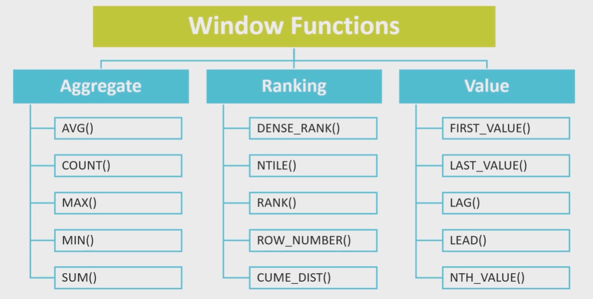

# SQL

### Создание таблиц

Студенты (`students`), Курсы (`courses`), Оценки (`course_grades`).

```sql
DROP TABLE IF EXISTS course_grades;
DROP TABLE IF EXISTS students;
DROP TABLE IF EXISTS courses;
```

* `CHECK` – проверка значения поля при вставке значения.
* `SERIAL` == `INT` + sequence.
* `PRIMARY KEY` – на primary key всегда создается unique index.
* `ON DELETE / ON UPDATE` – действие выполняемое при удалении / обновлении записи на которую ссылается Foreign Key:
    * `SET NULL / DEFAULT` – в поле устанавливается `NULL` или значение по-умолчанию.
    * `CASCADE` – удаляет строки из зависимой таблицы при удалении или изменении связанных строк в главной таблице.
    * `RESTRICT` – предотвращает какие-либо действия в зависимой таблице при удалении или изменении связанных строк в
      главной таблице.
    * `NO ACTION` – (действие по умолчанию) предотвращает какие-либо действия в зависимой таблице при удалении или
      изменении связанных строк в главной таблице и генерирует ошибку. (Главным отличием этих двух вариантов является
      то, что `NO ACTION` позволяет отложить проверку в процессе транзакции, а `RESTRICT` — нет)

```sql
CREATE TABLE students
(
    id        SERIAL PRIMARY KEY,
    firstname VARCHAR(80) NOT NULL,
    lastname  VARCHAR(80) NOT NULL,
    github    VARCHAR(80),
    "group"   VARCHAR(8)  NOT NULL CHECK ("group" IN ('ИУ7-11М', 'ИУ7-12М', 'ИУ7-13М'))
);

CREATE UNIQUE INDEX udx_students_github ON students (github);

CREATE TABLE courses
(
    id   SERIAL PRIMARY KEY,
    name VARCHAR(255) NOT NULL
);

CREATE INDEX idx_courses_name ON courses (name);

CREATE TABLE course_grades
(
    id         SERIAL PRIMARY KEY,
    grade      NUMERIC(8, 2)
        CHECK (grade BETWEEN 2 AND 5),
    course_id  INT
        CONSTRAINT fk_course_grades_course_id REFERENCES courses (id)
            ON DELETE CASCADE,
    student_id INT
        CONSTRAINT fk_course_grades_student_id REFERENCES students (id)
            ON DELETE SET NULL
);

CREATE INDEX idx_course_grades_grade ON course_grades (grade);
CREATE INDEX idx_course_grades_course_id ON course_grades (course_id);
CREATE INDEX idx_course_grades_student_id ON course_grades (student_id);
```

### Заполнение таблиц данных

* `COPY ... FROM ... CSV` – вставка из csv файла (файл лежит внутри контейнера postgres).
* `INSERT INTO ... SELECT` – вставка в таблицу результата select.

```sql
COPY students (lastname, firstname, github, "group")
    FROM '/opt/data/students.csv'
    DELIMITER ';'
    CSV HEADER;

SELECT *
FROM students;

COPY courses (name)
    FROM '/opt/data/courses.csv'
    DELIMITER ';'
    CSV HEADER;

SELECT *
FROM courses;

INSERT INTO course_grades(grade, course_id, student_id)
    (SELECT FLOOR(RANDOM() * 7 + 4) * 0.5, c.id, s.id
     FROM students s
        , courses c);

SELECT c.name                           AS course
     , cg.grade                         AS grade
     , s.firstname || ' ' || s.lastname AS name
     , s."group"                        AS "group"
FROM course_grades cg
    INNER JOIN students s ON s.id = cg.student_id
    INNER JOIN courses c ON c.id = cg.course_id
WHERE c.id = 1;
```

### Агрегирующие функции

* `AVG`, `COUNT`, `SUM` – агрегирующие функции требуют группировку по другим полям в select.
* `HAVING` – фильтрация по результату агрегации.
* `DISTINCT` – удаляет из результата одинаковые записи.

Количество студентов, у которых средний бал больше 4.2.

```sql
SELECT s.firstname || ' ' || s.lastname AS student_name
     , AVG(cg.grade)                    AS average_grade
FROM course_grades cg
    INNER JOIN students s ON s.id = cg.student_id
GROUP BY student_name
HAVING AVG(cg.grade) > 4.2;
```

Студенты, у которых есть хотя бы одна тройка.

```sql
-- с использованием DISTINCT
SELECT DISTINCT s.firstname || ' ' || s.lastname AS student_name
FROM course_grades cg
    INNER JOIN students s ON s.id = cg.student_id
WHERE cg.grade < 4;

-- с использованием GROUP BY
SELECT s.firstname || ' ' || s.lastname AS student_name
FROM course_grades cg
    INNER JOIN students s ON s.id = cg.student_id
WHERE cg.grade < 4
GROUP BY student_name;
```

### Subselect

Вывести всех студентов, у которых есть хотя бы одна пятерка.

```sql
SELECT s.firstname || ' ' || s.lastname AS student_name
FROM students s
WHERE EXISTS(SELECT 1 FROM course_grades cg WHERE cg.student_id = s.id AND cg.grade = 5)
GROUP BY student_name;
```

### Grouping by

The result of the `SELECT` and `WHERE` clauses are grouped separately by each specified group in the grouping set, and
aggregates functions executed for each group same as simple `GROUP BY` clauses, and then the final results are returned.

Вывести средний бал всех студентов и средний бал по группе:

```sql
SELECT s.firstname || ' ' || s.lastname AS student_name
     , s.group                          AS "group"
     , AVG(cg.grade)                    AS average_grade
FROM students s
    INNER JOIN course_grades cg ON s.id = cg.student_id
GROUP BY GROUPING SETS ((student_name, s.group), (s.group));
```

Аналогично решению через `UNION ALL`:

```sql
SELECT s.firstname || ' ' || s.lastname AS student_name
     , AVG(cg.grade)                    AS average_grade
FROM students s
    INNER JOIN course_grades cg ON s.id = cg.student_id
GROUP BY student_name

UNION ALL

SELECT s.group       AS "group"
     , AVG(cg.grade) AS average_grade
FROM students s
    INNER JOIN course_grades cg ON s.id = cg.student_id
GROUP BY "group"
```

### Pagination

Вывести список группы ИУ7-11М с пагинацией по 10 записей.

```sql
SELECT s.*
FROM students s
WHERE s."group" = 'ИУ7-11М'
ORDER BY s.lastname, s.firstname
LIMIT 10 OFFSET 10;
```

```sql
SELECT s.*
FROM students s
WHERE s."group" = 'ИУ7-11М'
  AND s.id > 10
ORDER BY s.lastname, s.firstname
LIMIT 10;
```

```sql
SELECT s.*
FROM students s
WHERE s."group" = 'ИУ7-11М'
ORDER BY s.lastname, s.firstname
    FETCH FIRST 10 ROWS ONLY
OFFSET 10 ROWS;
```

### Filter

* `CASE WHEN ... THEN ... ELSE ... END` – условие обработки результата.
* `FILTER (WHEN ...)` – фильтрация результата (полезно для `SUM`)

Вывести количество 2, 3, 4 и 5 в разрезе групп:

```sql
SELECT s."group"                                            AS "group"
     , SUM(CASE WHEN FLOOR(cg.grade) = 2 THEN 1 ELSE 0 END) AS "2"
     , SUM(CASE WHEN FLOOR(cg.grade) = 3 THEN 1 ELSE 0 END) AS "3"
     , SUM(CASE WHEN FLOOR(cg.grade) = 4 THEN 1 ELSE 0 END) AS "4"
     , SUM(CASE WHEN FLOOR(cg.grade) = 5 THEN 1 ELSE 0 END) AS "5"
FROM students s
    INNER JOIN course_grades cg ON s.id = cg.student_id
WHERE cg.course_id = (SELECT c.id FROM courses c WHERE c.name = 'РСОИ')
GROUP BY "group";
```

```sql
SELECT s."group"                                   AS "group"
     , COUNT(1) FILTER (WHERE FLOOR(cg.grade) = 2) AS "2"
     , COUNT(1) FILTER (WHERE FLOOR(cg.grade) = 3) AS "3"
     , COUNT(1) FILTER (WHERE FLOOR(cg.grade) = 4) AS "4"
     , COUNT(1) FILTER (WHERE FLOOR(cg.grade) = 5) AS "5"
FROM students s
    INNER JOIN course_grades cg ON s.id = cg.student_id
WHERE cg.course_id = (SELECT c.id FROM courses c WHERE c.name = 'РСОИ')
GROUP BY "group";
```

### Inline View

```sql
WITH student_avg_grade AS (
    SELECT s.firstname || ' ' || s.lastname AS student_name
         , AVG(cg.grade)                    AS average_grade
    FROM course_grades cg
        INNER JOIN students s ON s.id = cg.student_id
    GROUP BY student_name
)
SELECT *
FROM student_avg_grade sag
WHERE sag.average_grade > 4.2;
```

Удаление данных из основной таблицы в history. Метод возвращает список реально удаленных записей.

`RETURNING *` – возвращает всю удаленную строку, `RETURNING id` – только id. Конструкция `RETURNING` применима
для `INSERT`, `UPDATE`, `DELETE`.

`CREATE TABLE ... (LIKE ...)` – создание таблицы на основе DDL другой таблицы.

```sql
CREATE TABLE students_history
(
    LIKE students
);

CREATE OR REPLACE FUNCTION delete_students(ids INT[])
    RETURNS TABLE
            (
                STUDENT_ID INT
            )
AS
$$
BEGIN
    RETURN QUERY
        WITH deleted_rows AS (DELETE FROM students WHERE id = ANY (ids) RETURNING *)
            INSERT INTO students_history (SELECT * FROM deleted_rows) RETURNING id;
END;
$$
    LANGUAGE plpgsql;

SELECT delete_students(ARRAY [1, 2, 3]);
```

### Recursive View

Используя `RECURSIVE`, запрос `WITH` может обращаться к собственному результату. В общем виде рекурсивный запрос `WITH`
всегда записывается как не рекурсивная часть, потом `UNION` (или `UNION ALL`), а затем рекурсивная часть, где только в
рекурсивной части можно обратиться к результату запроса.

##### Вычисление рекурсивного запроса

1. Вычисляется не рекурсивная часть. Для `UNION` (но не `UNION ALL`) отбрасываются дублирующиеся строки. Все оставшиеся
   строки включаются в результат рекурсивного запроса и также помещаются во временную рабочую таблицу.
2. Пока рабочая таблица не пуста, повторяются следующие действия:
    * Вычисляется рекурсивная часть так, что рекурсивная ссылка на сам запрос обращается к текущему содержимому рабочей
      таблицы. Для `UNION` (но не `UNION ALL`) отбрасываются дублирующиеся строки и строки, дублирующие ранее
      полученные. Все оставшиеся строки включаются в результат рекурсивного запроса и также помещаются во временную
      промежуточную таблицу.
    * Содержимое рабочей таблицы заменяется содержимым промежуточной таблицы, а затем промежуточная таблица очищается.

Рекурсивное вычисление факториала.

```sql
WITH RECURSIVE fact (n, factorial) AS (
    SELECT 1::NUMERIC
         , 1::NUMERIC

    UNION ALL

    SELECT n + 1         AS n
         , factorial * n AS factorial
    FROM fact
    WHERE n < 20
)
SELECT *
FROM fact;
```

Вычисление чисел Фибоначчи:

```sql
WITH RECURSIVE fib(a, b) AS (
    SELECT 0::NUMERIC
         , 1::NUMERIC

    UNION ALL

    SELECT GREATEST(a, b), a + b AS a
    FROM fib
    WHERE a <= 100000
)
SELECT a
FROM fib;
```

`WITH RECURSIVE` можно применять для обхода дерева:

```sql
DROP TABLE IF EXISTS geo;
CREATE TABLE geo
(
    id        SERIAL PRIMARY KEY,
    parent_id INT
        CONSTRAINT fk_geo_parent_id REFERENCES geo (id),
    name      VARCHAR(80)
);
```

```sql
INSERT INTO geo (id, parent_id, name)
VALUES (1, NULL, 'Планета Земля')
     , (2, 1, 'Евразия')
     , (3, 1, 'Северная Америка')
     , (4, 2, 'Европа')
     , (5, 4, 'Россия')
     , (6, 4, 'Германия')
     , (7, 5, 'Москва')
     , (8, 5, 'Санкт-Петербург')
     , (9, 6, 'Берлин');
```

```sql
WITH RECURSIVE recursive AS (
    SELECT g.id        AS id
         , g.parent_id AS parent
         , g.name      AS name
         , 1           AS level
    FROM geo g
    WHERE g.id = 1

    UNION ALL

    SELECT g.id                AS id
         , g.parent_id         AS parent
         , g.name              AS name
         , recursive.level + 1 AS level
    FROM geo g
        JOIN recursive
             ON g.parent_id = recursive.id
)
SELECT *
FROM recursive;
```

### Materialized View

Информация о `MATERIALIZED VIEW` в системных каталогах Postgres ничем не отличается от информации о таблице или
представлении. Поэтому для анализатора запроса материализованное представление является просто отношением, как таблица
или представление.

Когда запрос обращается к `MATERIALIZED VIEW`, данные возвращаются непосредственно из него, как из таблицы; запрос
применяется, только чтобы его наполнить, поэтому данные в нем могут быть не актуальные.

```sql
DROP MATERIALIZED VIEW average_grade_by_groups;

CREATE MATERIALIZED VIEW average_grade_by_groups AS
SELECT s.*
     , AVG(cg.grade) OVER (PARTITION BY s."group") AS average_grade
FROM students AS s
    INNER JOIN course_grades cg ON s.id = cg.student_id
WHERE cg.course_id = (SELECT C.id FROM courses C WHERE C.name = 'РСОИ');

SELECT r."group"       AS "group"
     , r.average_grade AS average_grade
FROM average_grade_by_groups r
GROUP BY "group", average_grade
ORDER BY average_grade DESC;

UPDATE course_grades
SET grade = 5
WHERE course_id = (SELECT c.id FROM courses c WHERE c.name = 'РСОИ')
  AND student_id IN (SELECT s.id FROM students s WHERE s."group" = 'ИУ7-11М');

SELECT r."group"       AS "group"
     , r.average_grade AS average_grade
FROM average_grade_by_groups r
GROUP BY "group", average_grade
ORDER BY average_grade DESC;

REFRESH MATERIALIZED VIEW average_grade_by_groups;

SELECT r."group"       AS "group"
     , r.average_grade AS average_grade
FROM average_grade_by_groups r
GROUP BY "group", average_grade
ORDER BY average_grade DESC;

DROP INDEX IF EXISTS idx_average_grade_by_groups_firstname_lastname;
CREATE UNIQUE INDEX IF NOT EXISTS idx_average_grade_by_groups_firstname_lastname ON average_grade_by_groups (firstname, lastname);

-- На маленьких объемах данных Postgres предпочтет sequence scan,
-- т.к. все данные умещаются на одной странице, следовательно потребуется только одна I/O операция.
EXPLAIN
SELECT s.*
FROM average_grade_by_groups s
WHERE s.lastname = 'Романов'
  AND s.firstname = 'Алексей';

SELECT t.relname                           AS table_name
     , i.relname                           AS index_name
     , array_position(ix.indkey, a.attnum) AS pos
     , a.attname                           AS column_name
FROM pg_class t
    JOIN pg_index ix ON t.oid = ix.indrelid
    JOIN pg_class i ON i.oid = ix.indexrelid
    JOIN pg_attribute a ON a.attrelid = t.oid AND a.attnum = ANY (ix.indkey)
WHERE t.relname = 'average_grade_by_groups'
ORDER BY t.relname, i.relname, array_position(ix.indkey, a.attnum);
```

### LATERAL JOIN

`LATERAL JOIN` – subquery appearing in `FROM` can be preceded by the key word LATERAL. This allows them to reference
columns provided by preceding `FROM` items. (Without LATERAL, each subquery is evaluated independently and so cannot
cross-reference any other `FROM` item.)

A `LATERAL JOIN` is more like a correlated subquery, not a plain subquery, in that expressions to the right of
a `LATERAL JOIN` are evaluated once for each row left of it – just like a correlated subquery – while a plain subquery (
table expression) is evaluated once only.

Найти какой предмет студент сдал лучше всего.

```sql
SELECT s.firstname || ' ' || s.lastname                       AS student_name
     , s."group"                                              AS "group"
     , cg.grade                                               AS grade
     , (SELECT name FROM courses c WHERE cg.course_id = c.id) AS course
FROM students s
    JOIN LATERAL (SELECT *
                  FROM course_grades cg
                  WHERE s.id = cg.student_id
                  ORDER BY cg.grade DESC
                  LIMIT 1) cg
         ON TRUE
ORDER BY "group", student_name, grade DESC;
```

#### Window function

Оконная функция выполняет вычисления для набора строк, некоторым образом связанных с текущей строкой. Можно сравнить её
с агрегатной функцией, но, в отличие от обычной агрегатной функции, при использовании оконной функции несколько строк не
группируются в одну, а продолжают существовать отдельно. Внутри же, оконная функция, как и агрегатная, может обращаться
не только к текущей строке результата запроса. Есть ещё одно важное понятие, связанное с оконными функциями: для каждой
строки существует набор строк в её разделе, называемый рамкой окна. По умолчанию, с указанием `ORDER BY` рамка состоит
из всех строк от начала раздела до текущей строки и строк, равных текущей по значению выражения `ORDER BY`.
Без `ORDER BY`
рамка по умолчанию состоит из всех строк раздела.

Для простоты понимания можно считать, что Postgres сначала выполняет весь запрос (кроме сортировки и `LIMIT`), а потом
только просчитывает оконные выражения.

Окно — это некоторое выражение, описывающее набор строк, которые будет обрабатывать функция и порядок этой обработки.
Причем окно может быть просто задано пустыми скобками (), т.е. окном являются все строки результата запроса.



Оконные функции можно разделить на три класса:

##### Агрегирующие (Aggregate)

Можно применять любую из агрегирующих функций - `SUM`, `AVG`, `COUNT`, `MIN`, `MAX`.

##### Ранжирующие (Ranking)

В ранжирующих функция под ключевым словом OVER обязательным идет указание условия `ORDER BY`, по которому будет
происходить сортировка ранжирования.

* `ROW_NUMBER()` - функция вычисляет последовательность ранг (порядковый номер) строк внутри партиции, НЕЗАВИСИМО от
  того, есть ли в строках повторяющиеся значения или нет.
* `RANK()` - функция вычисляет ранг каждой строки внутри партиции. Если есть повторяющиеся значения, функция возвращает
  одинаковый ранг для таких строчек, пропуская при этом следующий числовой ранг.
* `DENSE_RANK()` - то же самое что и `RANK`, только в случае одинаковых значений `DENSE_RANK` не пропускает следующий
  числовой ранг, а идет последовательно.

##### Функции смещения (Value)

Это функции, которые позволяют перемещаясь по выделенной партиции таблицы обращаться к предыдущему значению строки или
крайним значениям строк в партиции.

* `LAG()` / `LEAD()` – предыдущее следующее значение.
* `FIRST_VALUE()` / `LAST_VALUE()` - первое / последнее значение.

В каждой группе вывести топ 3 студентов по РСОИ.

```sql
SELECT cg.*
FROM (SELECT cg.grade                                                          AS grade
           , s.firstname || ' ' || s.lastname                                  AS student_name
           , s."group"                                                         AS "group"
           , ROW_NUMBER() OVER (PARTITION BY s."group" ORDER BY cg.grade DESC) AS rn
      FROM course_grades cg
          INNER JOIN students s ON s.id = cg.student_id
      WHERE cg.course_id = (SELECT c.id FROM courses c WHERE c.name = 'РСОИ')) cg
WHERE cg.rn <= 3;
```

Вывести среднюю оценку по группе по курсу РСОИ:

```sql
SELECT r."group"       AS "group"
     , r.average_grade AS average_grade
FROM (SELECT s.group
           , AVG(cg.grade) OVER (PARTITION BY s."group") AS average_grade
      FROM students AS s
          INNER JOIN course_grades cg ON s.id = cg.student_id
      WHERE cg.course_id = (SELECT C.id FROM courses C WHERE C.name = 'РСОИ')) r
GROUP BY "group", average_grade
ORDER BY average_grade DESC;
```

### Upsert

Предложение `ON CONFLICT` позволяет задать действие, заменяющее возникновение ошибки при нарушении ограничения
уникальности или ограничения.

* `ON CONFLICT (id)` – constraint violation на поле.
* `ON CONFLICT ON CONSTRAINT students_pkey` – constraint violation по имени.

Варианты разрешения конфликта:

* `DO UPDATE SET field = EXCLUDED.field ` – обновить значения поля данными из блока `VALUES`;
* `DO NOTHING` – ничего не делать;

```sql
INSERT INTO students (firstname, lastname, github, "group")
VALUES ('Alexey', 'Romanov', 'gryteck', 'ИУ7-13М')
ON CONFLICT(github) DO UPDATE SET firstname = excluded.firstname
                                , lastname  = excluded.lastname
                                , "group"   = excluded."group";

SELECT * FROM students WHERE id = 1;
```

### SELECT FOR UPDATE

В режиме `FOR UPDATE` строки, выданные оператором `SELECT`, блокируются как для изменения. При этом они защищаются от
блокировки, изменения и удаления другими транзакциями до завершения текущей. То есть другие транзакции, пытающиеся
выполнить `UPDATE`, `DELETE`, `SELECT FOR UPDATE` и т.д. с этими строками, будут заблокированы до завершения текущей
транзакции; и наоборот, команда `SELECT FOR UPDATE` будет ожидать окончания параллельной транзакции, в которой
выполнилась одна из этих команд с той же строкой, а затем установит блокировку и вернёт изменённую строку (или не
вернёт, если она была удалена). Режим блокировки `FOR UPDATE` также запрашивается на уровне строки любой
командой `DELETE` и командой `UPDATE`, изменяющей значения определённых столбцов.

```sql
BEGIN TRANSACTION;
SELECT * FROM students s WHERE id = 1 FOR UPDATE;
END TRANSACTION;
```

```sql
UPDATE students
SET github = 'romanow'
WHERE lastname = 'Романов'
  AND firstname = 'Алексей';
```

### ARRAY

Postgres позволяет определять столбцы таблицы как многомерные массивы переменной длины. Элементами массивов могут быть
любые встроенные или определённые пользователями базовые типы, перечисления, составные типы;

```sql
CREATE TABLE array_table
(
    arr INT[]
);

INSERT INTO array_table (arr) VALUES ('{1, 2, 3, 4, 5}');
INSERT INTO array_table (arr) VALUES (ARRAY [6, 7, 8, 9, 10]);

SELECT t.arr[2:4] FROM array_table t;
SELECT t.arr || ARRAY [11, 12] FROM array_table t;
SELECT t.arr FROM array_table t WHERE 5 = ANY (t.arr);
SELECT UNNEST(t.arr) FROM array_table t;
```

### JSON

Типы `JSON` предназначены для хранения данных JSON (JavaScript Object Notation) согласно
стандарту [RFC 7159](https://tools.ietf.org/html/rfc7159). Такие данные можно хранить и в типе `text`, но типы `JSON`
лучше тем, что проверяют, соответствует ли вводимое значение формату JSON.

В Postgres имеются два типа для хранения данных JSON: `json` и `jsonb`. Тип `json` сохраняет точную копию введённого
текста, которую функции обработки должны разбирать заново при каждом выполнении запроса, тогда как данные `jsonb`
сохраняются в разобранном двоичном формате, что несколько замедляет ввод из-за преобразования, но значительно ускоряет
обработку, не требуя многократного разбора текста. Кроме того, `jsonb` поддерживает индексацию, что тоже может быть
очень полезно.

```sql
CREATE TABLE json_table
(
    data JSONB
);

INSERT INTO json_table (data)
VALUES ('{
  "name": "Alex",
  "login": "ronin",
  "work": "Innotech",
  "address": {
    "city": "Moscow",
    "street": "Molostovih"
  },
  "hobbies": [
    "MTB",
    "Ski Freeride"
  ]
}');

-- -> as json, ->> as text
SELECT data -> 'address' -> 'street' FROM json_table;
SELECT data -> 'hobbies' -> 0 FROM json_table;
SELECT data ->> 'address' FROM json_table;
SELECT data #> '{address, street}' FROM json_table;

SELECT data @> '{"login": "ronin"}' FROM json_table;
SELECT data || '{"new_hobbies": ["Road Bikes"]}'::JSONB FROM json_table;

SELECT data @ ? '$.hobbies[*] >= 2' FROM json_table;
```

### Ссылки

1. [Modern SQL](https://modern-sql.com/)
2. [We need tool support for keyset pagination](https://use-the-index-luke.com/no-offset)
3. [SQL Slides by Markus Winand](https://winand.at/sql-slides-for-developers)
4. [Оконные функции SQL простым языком с примерами](https://habr.com/ru/post/664000/)